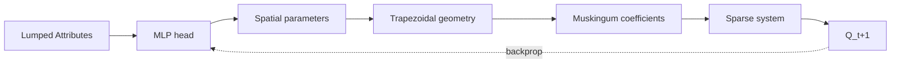
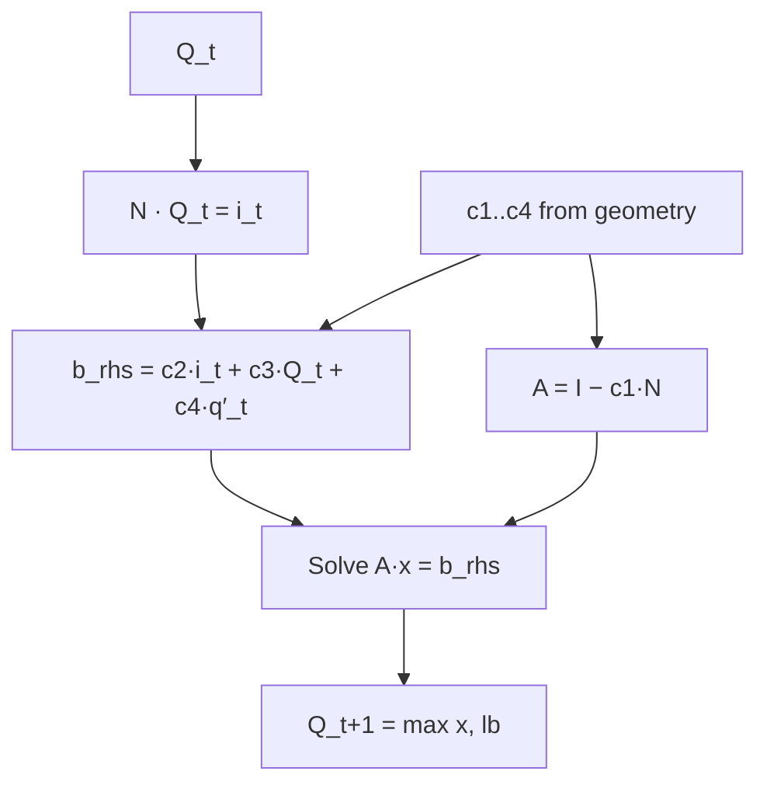

# ddrs documentation system — implementation plan

> **For agentic workers:** REQUIRED SUB-SKILL: Use superpowers:subagent-driven-development (recommended) or superpowers:executing-plans to implement this plan task-by-task. Steps use checkbox (`- [ ]`) syntax for tracking.

**Goal:** Stand up a karpathy-style documentation system for `ddrs` — canonical agent-readable skills under `.claude/skills/` as source of truth, AI-expanded mdBook chapters under `docs/`, published to GitHub Pages via Actions.

**Architecture:** Each concept gets one canonical `.claude/skills/ddrs-*.md` with YAML frontmatter declaring an `output:` chapter path and a `sources:` list. A `/regenerate-docs` meta-skill reads each canonical skill + its declared sources + recent git history and writes the expanded chapter. mdBook builds `docs/` → `target/book/` → deploys via `actions/deploy-pages@v4`.

**Tech Stack:** mdBook (Rust), `mdbook-katex`, `mdbook-mermaid`, GitHub Actions, YAML frontmatter, small JSON state file.

**Spec:** `.claude/specs/2026-05-29-ddrs-docs-design.md`

---

## Pre-flight: repo state at plan start

- `/home/tbindas/projects/ddrs` on `master` at `bfba936` (in sync with origin/master).
- One existing skill: `.claude/skills/burn_custom_backward.md` (no frontmatter).
- CLAUDE.md references it at lines 30 and 110.
- No `docs/`, no `book.toml`, no `.github/workflows/`.
- V1 invariant: `cargo run --release --example compare_ddr_sandbox` must continue to report ABSOLUTE MATCH. This plan touches zero Rust source, so V1 cannot regress; the final task re-confirms.

---

## File structure (created by this plan)

```
ddrs/
├── book.toml                                  Task 1
├── docs/
│   ├── SUMMARY.md                             Task 18 (written by /regenerate-docs)
│   ├── intro.md                               Task 1 (placeholder); refined by Task 18
│   ├── setup.md                               Task 18
│   ├── architecture.md                        Task 18
│   ├── algorithm.md                           Task 18
│   ├── usage/
│   │   ├── running.md                         Task 18
│   │   ├── inputs-reading.md                  Task 18
│   │   ├── inputs-formatting.md               Task 18
│   │   ├── graph-objects.md                   Task 18
│   │   └── outputs.md                         Task 18
│   ├── reference/
│   │   ├── ddr-comparison.md                  Task 18
│   │   ├── perf.md                            Task 18
│   │   └── burn-autograd.md                   Task 18
│   └── images/.gitkeep                        Task 1
├── .github/workflows/docs.yml                 Task 2
├── .claude/skills/
│   ├── ddrs-burn-autograd.md                  Task 4 (renamed from burn_custom_backward.md)
│   ├── ddrs-setup.md                          Task 5
│   ├── ddrs-architecture.md                   Task 6
│   ├── ddrs-algorithm.md                      Task 7
│   ├── ddrs-running-the-code.md               Task 8
│   ├── ddrs-reading-inputs.md                 Task 9
│   ├── ddrs-formatting-inputs.md              Task 10
│   ├── ddrs-graph-objects.md                  Task 11
│   ├── ddrs-reading-outputs.md                Task 12
│   ├── ddrs-comparing-to-ddr.md               Task 13
│   ├── ddrs-perf-and-cuda-graphs.md           Task 14
│   ├── regenerate-docs.md                     Task 16
│   └── .regenerate-state.json                 Task 17
├── CLAUDE.md                                  Task 4 (update skill path × 2 lines)
└── .gitignore                                 already covers target/
```

---

## Conventions for this plan

- One commit per task. No `--amend`.
- Commit footer always:
  ```
  Co-Authored-By: Claude Opus 4.7 (1M context) <noreply@anthropic.com>
  ```
- All canonical skills (Tasks 4–14) follow the **frontmatter contract** defined in Task 5. Re-use that contract verbatim; do not invent fields.
- All canonical skill bodies use the **structural template** defined in Task 5. The template is identical across skills; only content changes.
- mdBook build is the gate after Tasks 1 and 20. `mdbook build` from repo root must exit 0 with no warnings.
- Verification at each task end is explicit; no "should work" hand-waving.

---

### Task 1: mdBook scaffolding (book.toml + placeholder docs/)

Set up the minimum mdBook can build. No content yet — just enough for `mdbook build` to succeed.

**Files:**
- Create: `book.toml`
- Create: `docs/SUMMARY.md`
- Create: `docs/intro.md`
- Create: `docs/images/.gitkeep`

- [ ] **Step 1: Install mdbook locally for testing**

```bash
cargo install --locked mdbook
cargo install --locked mdbook-katex
cargo install --locked mdbook-mermaid
mdbook --version
mdbook-katex --version
mdbook-mermaid --version
```

Expected: each prints a version number cleanly. If any install fails, fix
before proceeding (likely missing system deps like `pkg-config` or
`fontconfig`).

- [ ] **Step 2: Write `book.toml`**

```toml
[book]
title = "ddrs"
authors = ["Tadd Bindas"]
description = "BURN-based differentiable Muskingum-Cunge routing in Rust"
src = "docs"
language = "en"

[build]
build-dir = "target/book"
create-missing = false

[preprocessor.katex]
no-css = false

[preprocessor.mermaid]
command = "mdbook-mermaid"

[output.html]
default-theme = "rust"
preferred-dark-theme = "ayu"
git-repository-url = "https://github.com/taddyb/ddrs"
edit-url-template = "https://github.com/taddyb/ddrs/edit/master/docs/{path}"
mathjax-support = false

[output.html.search]
enable = true
limit-results = 30
use-boolean-and = true
```

- [ ] **Step 3: Write a placeholder `docs/SUMMARY.md`**

```markdown
# Summary

- [Introduction](intro.md)
```

- [ ] **Step 4: Write a placeholder `docs/intro.md`**

```markdown
# ddrs

A BURN-based Rust port of the differentiable Muskingum-Cunge routing solver
from [DDR](https://github.com/mhpi/ddr).

> This documentation is in active development. Chapters will fill in via the
> `/regenerate-docs` skill workflow.
```

- [ ] **Step 5: Create empty images dir**

```bash
mkdir -p docs/images
touch docs/images/.gitkeep
```

- [ ] **Step 6: Verify `mdbook build` succeeds**

```bash
cd /home/tbindas/projects/ddrs
mdbook build
ls target/book/index.html
```

Expected: build runs without errors; `target/book/index.html` exists. Open
in a browser as a sanity check; the placeholder page should render.

- [ ] **Step 7: Commit**

```bash
git add book.toml docs/
git commit -m "$(cat <<'EOF'
docs: scaffold mdBook with book.toml + placeholder intro

Sets up the Rust-idiomatic mdBook layout: source in docs/, output to
target/book/ (under the existing gitignored target/). Configures katex
+ mermaid preprocessors and the default 'rust' theme. Empty intro plus
SUMMARY.md provides a buildable baseline; chapters land via the
/regenerate-docs skill workflow in later tasks.

Co-Authored-By: Claude Opus 4.7 (1M context) <noreply@anthropic.com>
EOF
)"
```

---

### Task 2: GitHub Actions workflow for build + deploy

Add the CI workflow that builds the book on every push/PR and deploys to
Pages from `master`.

**Files:**
- Create: `.github/workflows/docs.yml`

- [ ] **Step 1: Write the workflow**

```yaml
name: docs
on:
  push:
    branches: [master]
    paths:
      - docs/**
      - book.toml
      - .github/workflows/docs.yml
  pull_request:
    paths:
      - docs/**
      - book.toml
      - .github/workflows/docs.yml
  workflow_dispatch:

jobs:
  build:
    runs-on: ubuntu-latest
    steps:
      - uses: actions/checkout@v4
      - uses: dtolnay/rust-toolchain@stable
      - uses: Swatinem/rust-cache@v2
        with:
          shared-key: docs-mdbook
      - name: Install mdbook + preprocessors
        run: |
          cargo install --locked mdbook
          cargo install --locked mdbook-katex
          cargo install --locked mdbook-mermaid
      - name: Build
        run: mdbook build
      - uses: actions/upload-pages-artifact@v3
        if: github.ref == 'refs/heads/master'
        with:
          path: target/book

  deploy:
    needs: build
    if: github.ref == 'refs/heads/master'
    runs-on: ubuntu-latest
    permissions:
      pages: write
      id-token: write
    environment:
      name: github-pages
      url: ${{ steps.deployment.outputs.page_url }}
    steps:
      - id: deployment
        uses: actions/deploy-pages@v4
```

- [ ] **Step 2: Lint the YAML locally (optional but cheap)**

```bash
python3 -c "import yaml; yaml.safe_load(open('.github/workflows/docs.yml'))"
```

Expected: silent exit (no parse error). If `python3` isn't available, skip;
GitHub will validate on push.

- [ ] **Step 3: Commit**

```bash
git add .github/workflows/docs.yml
git commit -m "$(cat <<'EOF'
docs: add GitHub Actions workflow to build + deploy mdBook

Builds on every push/PR touching docs/, book.toml, or the workflow itself.
Deploys from master via actions/deploy-pages@v4 (modern branchless Pages
deploy — no gh-pages branch). Uses Swatinem/rust-cache to keep cargo-installed
mdbook binaries warm across runs.

GitHub Pages must still be enabled in repo Settings → Pages → Source:
GitHub Actions before the first deploy succeeds (Task 3 documents this).

Co-Authored-By: Claude Opus 4.7 (1M context) <noreply@anthropic.com>
EOF
)"
```

---

### Task 3: Enable GitHub Pages + sanity-check first deploy

This is a manual repo-settings task plus a push-driven verification.

**Files:** none modified

- [ ] **Step 1: Enable Pages**

Open https://github.com/taddyb/ddrs/settings/pages and set:
- **Source:** GitHub Actions
- **Custom domain:** leave blank

- [ ] **Step 2: Push the previous two commits**

```bash
cd /home/tbindas/projects/ddrs
git push origin master
```

- [ ] **Step 3: Watch the workflow run**

```bash
gh run watch
```

Expected: `docs / build` and `docs / deploy` both green. The deploy job's
output includes a URL like `https://taddyb.github.io/ddrs/`.

- [ ] **Step 4: Visit the published site**

Open `https://taddyb.github.io/ddrs/` in a browser. Expected: the
placeholder intro page renders with the default mdBook theme, search box
in the sidebar, dark/light toggle works.

- [ ] **Step 5: No commit — settings change is on GitHub, not in the repo**

(Nothing to commit. Move to Task 4.)

---

### Task 4: Rename `burn_custom_backward.md` → `ddrs-burn-autograd.md`

Smallest possible content change — validates the rename pattern and
updates CLAUDE.md's two references before any other canonical skill
work depends on the new naming convention.

**Files:**
- Move: `.claude/skills/burn_custom_backward.md` → `.claude/skills/ddrs-burn-autograd.md`
- Modify: `CLAUDE.md` lines 30 and 110

- [ ] **Step 1: Move the file**

```bash
cd /home/tbindas/projects/ddrs
git mv .claude/skills/burn_custom_backward.md .claude/skills/ddrs-burn-autograd.md
```

- [ ] **Step 2: Add frontmatter to the renamed skill**

Open `.claude/skills/ddrs-burn-autograd.md`. Insert at the very top
(before the existing `# BURN 0.21 — registering...` heading):

```markdown
---
name: ddrs-burn-autograd
description: BURN 0.21 recipe for registering a custom Backward op from a downstream crate. Visibility map of public/private autograd types; canonical Backward<B, N> pattern.
output: reference/burn-autograd.md
sources:
  - src/sparse/mod.rs
  - src/routing/mmc_op.rs
---

```

Keep the original body unchanged below the frontmatter.

- [ ] **Step 3: Update CLAUDE.md references**

In `CLAUDE.md`, change two lines.

Line 30:
```
- `.claude/skills/burn_custom_backward.md` for the BURN-0.21 recipe it uses.
```
becomes:
```
- `.claude/skills/ddrs-burn-autograd.md` for the BURN-0.21 recipe it uses.
```

Line 110:
```
- Sparse / autograd questions → `.claude/skills/burn_custom_backward.md`
```
becomes:
```
- Sparse / autograd questions → `.claude/skills/ddrs-burn-autograd.md`
```

- [ ] **Step 4: Confirm no other references exist**

```bash
git grep -n "burn_custom_backward" 2>&1
```

Expected: zero results. If anything else still references the old path,
update it.

- [ ] **Step 5: Commit**

```bash
git add .claude/skills/ddrs-burn-autograd.md CLAUDE.md
git commit -m "$(cat <<'EOF'
docs: rename burn_custom_backward → ddrs-burn-autograd; add frontmatter

Adopts the ddrs-* skill naming convention (matches new canonical skills
landing in later tasks). Adds YAML frontmatter with output:/sources: fields
the regenerate-docs meta-skill will read. CLAUDE.md updated to point at the
new path at both references (lines 30 + 110).

No body changes; skill content is unchanged.

Co-Authored-By: Claude Opus 4.7 (1M context) <noreply@anthropic.com>
EOF
)"
```

---

### Task 5: Write `ddrs-setup.md` (and lock the skill template)

This is the first new canonical skill. Its frontmatter + body structure
defines the **template** all subsequent canonical-skill tasks (Tasks 6–14)
follow verbatim.

**Files:**
- Create: `.claude/skills/ddrs-setup.md`

- [ ] **Step 1: Read the source files this skill will reference**

```bash
cd /home/tbindas/projects/ddrs
cat Cargo.toml
sed -n '1,80p' CLAUDE.md
ls config/
```

Confirm you understand:
- Rust toolchain version (cargo --version → `1.94.0`)
- cubecl fork path (`/home/tbindas/projects/cubecl`) + branch (`ddrs-release`)
- Data file locations from CLAUDE.md's "Data sources" table
- That `compare_ddr_sandbox` requires `fixtures/sandbox/` (regenerated by `scripts/export_ddr_sandbox.py` under DDR's uv venv)

- [ ] **Step 2: Write the skill file**

Create `.claude/skills/ddrs-setup.md` with this structure (the template
all canonical skills follow):

````markdown
---
name: ddrs-setup
description: How to set up a fresh ddrs checkout — Rust toolchain, the taddyb/cubecl fork @ ddrs-release, data file paths (zarr/netcdf/icechunk), DDR reference clone for fixture regeneration, and the uv environment.
output: setup.md
sources:
  - Cargo.toml
  - CLAUDE.md
  - README.md
---

# ddrs-setup

> Canonical agent-readable skill. Published chapter at `docs/setup.md`
> is regenerated from this file by `/regenerate-docs`.

## What to know

ddrs has four external dependencies the build resolves against:
1. **Rust stable** (≥ 1.80; tested on 1.94.0).
2. **The taddyb/cubecl fork** at `/home/tbindas/projects/cubecl` on branch `ddrs-release`. Patched into ddrs's `[patch.crates-io]` block in `Cargo.toml`. Carries three ddrs-specific patches over upstream cubecl 0.10: stream accessor, exclusive_with_server, flush_no_sync.
3. **CUDA Toolkit 12+ with driver 595+** for the GPU path (`sparse_solver: cuda` + `use_cuda_graphs: true` defaults in `config/merit_training.yaml`). The CPU path needs none of this and uses `burn-ndarray`.
4. **DDR reference repository** at `/home/tbindas/projects/ddr` for V1 fixture regeneration (`scripts/export_ddr_sandbox.py` runs under DDR's `uv` venv).

## Data file paths

From `CLAUDE.md` "Data sources":

| Source | Path |
|---|---|
| MERIT adjacency | `~/projects/ddr/data/merit_conus_adjacency.zarr` |
| Per-gauge subgraphs | `~/projects/ddr/data/merit_gages_conus_adjacency.zarr` |
| Catchment attributes | `~/projects/ddr/data/merit_global_attributes_v2.nc` |
| Streamflow forcing | `/mnt/ssd1/data/icechunk/merit_dhbv2_UH_retrospective.ic` |
| USGS observations | `/mnt/ssd1/data/icechunk/usgs_daily_observations` |

These paths are referenced from `config/merit_training.yaml`. If they live
elsewhere on a new machine, edit that YAML.

## Setup steps

```bash
# 1. Clone ddrs + cubecl fork.
git clone git@github.com:taddyb/ddrs ~/projects/ddrs
git clone -b ddrs-release git@github.com:taddyb/cubecl ~/projects/cubecl

# 2. Verify the cubecl path in Cargo.toml matches your clone location.
grep "/home/.*cubecl/crates/" ~/projects/ddrs/Cargo.toml

# 3. Clone the DDR reference (for V1 fixtures).
git clone git@github.com:mhpi/ddr ~/projects/ddr
cd ~/projects/ddr && uv sync --all-packages

# 4. Build.
cd ~/projects/ddrs
cargo build --release

# 5. Sanity check: V1 regression must report ABSOLUTE MATCH.
cargo run --release --example compare_ddr_sandbox
```

## Gotchas

- **The fork's branch was renamed** from `ddrs-sp7-stream-accessor` to
  `ddrs-release`. If you cloned earlier, `git fetch origin && git checkout
  ddrs-release` on the fork.
- **fixtures/sandbox/** is gitignored. If missing, regenerate via
  `cd ~/projects/ddr && uv run python ~/projects/ddrs/scripts/export_ddr_sandbox.py`.
- **CUDA defaults are on.** If on a CPU-only machine, override via temp
  YAML: `sparse_solver: cpu`, `use_cuda_graphs: false`.

## Verification

`cargo run --release --example compare_ddr_sandbox` must report
`ABSOLUTE MATCH` with `max abs < 1e-3 m³/s`. This is the V1 invariant from
`CLAUDE.md`; if it fails, the setup is wrong.
````

- [ ] **Step 3: Verify frontmatter parses as YAML**

```bash
python3 - <<'PY'
import re, sys, yaml
text = open('.claude/skills/ddrs-setup.md').read()
m = re.match(r'^---\n(.*?)\n---\n', text, re.S)
assert m, "no frontmatter"
fm = yaml.safe_load(m.group(1))
for k in ("name", "description", "output", "sources"):
    assert k in fm, f"missing {k}"
assert isinstance(fm["sources"], list)
print("ok:", fm["name"])
PY
```

Expected: `ok: ddrs-setup`. If `python3` / `yaml` not available, install
or skip (it'll fail in the meta-skill if malformed).

- [ ] **Step 4: Commit**

```bash
git add .claude/skills/ddrs-setup.md
git commit -m "$(cat <<'EOF'
docs: add ddrs-setup canonical skill

First skill following the new template: YAML frontmatter (name,
description, output, sources) + compressed instructional body covering
toolchain prereqs, cubecl fork @ ddrs-release, data file paths, DDR
reference clone, and verification via the V1 ABSOLUTE MATCH gate.

Subsequent canonical skills (architecture, algorithm, running, …) reuse
this frontmatter + body structure verbatim.

Co-Authored-By: Claude Opus 4.7 (1M context) <noreply@anthropic.com>
EOF
)"
```

---

### Task 6: Write `ddrs-architecture.md`

Module map + per-timestep dataflow. Sources include the SP-10 close-out
in `.claude/ARCHITECTURE.md`.

**Files:**
- Create: `.claude/skills/ddrs-architecture.md`

- [ ] **Step 1: Read the source files**

```bash
cd /home/tbindas/projects/ddrs
ls src/
ls src/routing/ src/sparse/ src/data/
cat .claude/ARCHITECTURE.md | head -100
sed -n '60,80p' CLAUDE.md
```

Identify: module boundaries, per-timestep dataflow stages (S1..S28),
and what `TimestepOp` saves for backward.

- [ ] **Step 2: Write the skill following the Task 5 template**

Create `.claude/skills/ddrs-architecture.md` matching the Task 5 structure
(frontmatter, "What to know", "Key files", "Gotchas", "Verification") but
with content sourced from the files above. Frontmatter:

```yaml
---
name: ddrs-architecture
description: Module map of the ddrs Rust crate plus the per-timestep dataflow through MuskingumCunge::route_timestep — geometry, Muskingum coefficients, SpMV, sparse solve, q_next clamp.
output: architecture.md
sources:
  - src/routing/mmc.rs
  - src/routing/mmc_op.rs
  - src/sparse/mod.rs
  - src/sparse/cusparse.rs
  - .claude/ARCHITECTURE.md
---
```

Body MUST include sections:
- `## What to know` (1-2 paragraph elevator pitch)
- `## Module map` (table with file → responsibility — mirror CLAUDE.md's "Architecture in one screen")
- `## Per-timestep dataflow` (S1..S28 summary; mirror the diagram in `.claude/ARCHITECTURE.md`)
- `## Autograd model` (one paragraph: TimestepOp = single custom Backward node per timestep instead of ~33; reference burn-autograd skill)
- `## Gotchas`
- `## Verification`

Length: 150–250 lines.

- [ ] **Step 3: Verify frontmatter parses (re-use the Task 5 Step 3 command)**

```bash
python3 - <<'PY'
import re, yaml
text = open('.claude/skills/ddrs-architecture.md').read()
m = re.match(r'^---\n(.*?)\n---\n', text, re.S)
fm = yaml.safe_load(m.group(1))
assert fm["name"] == "ddrs-architecture"
assert fm["output"] == "architecture.md"
print("ok")
PY
```

- [ ] **Step 4: Commit**

```bash
git add .claude/skills/ddrs-architecture.md
git commit -m "$(cat <<'EOF'
docs: add ddrs-architecture canonical skill

Module map + per-timestep dataflow + autograd model. Mirrors CLAUDE.md's
"Architecture in one screen" and .claude/ARCHITECTURE.md's S1..S28
diagram. Used by /regenerate-docs to expand into docs/architecture.md.

Co-Authored-By: Claude Opus 4.7 (1M context) <noreply@anthropic.com>
EOF
)"
```

---

### Task 7: Write `ddrs-algorithm.md`

Muskingum-Cunge math + trapezoidal geometry + why differentiable.

**Files:**
- Create: `.claude/skills/ddrs-algorithm.md`

- [ ] **Step 1: Read the source files**

```bash
cd /home/tbindas/projects/ddrs
cat src/geometry.rs
sed -n '500,710p' src/routing/mmc_op.rs   # forward_chain_inner: S1..S28
ls ~/projects/ddr/src/ddr/routing/
```

Identify: trapezoidal geometry (depth, top width, side slope, bottom
width, hyd radius via Leopold-Maddock), Muskingum-Cunge coefficient
derivation (k, c1..c4 from velocity + length + dt + x_storage), the
sparse linear system (I − N) Q_{t+1} = b_rhs.

- [ ] **Step 2: Write the skill**

Create `.claude/skills/ddrs-algorithm.md`. Frontmatter:

```yaml
---
name: ddrs-algorithm
description: The Muskingum-Cunge routing math implemented by ddrs — trapezoidal channel geometry (Leopold-Maddock), Muskingum coefficient derivation, the sparse linear system per timestep, why the whole chain is differentiable.
output: algorithm.md
sources:
  - src/geometry.rs
  - src/routing/mmc.rs
  - src/routing/mmc_op.rs
---
```

Body sections:
- `## What to know` (one paragraph: physics-based router + neural-net-learned params)
- `## Trapezoidal geometry` (Leopold-Maddock relations with KaTeX equations using `$$ ... $$`)
- `## Muskingum-Cunge coefficients` (k, c1..c4 derivation)
- `## The sparse system` ((I − c1·N) · Q_{t+1} = b_rhs; lower-triangular by topo order)
- `## Why differentiable` (registered params: n, q_spatial, p_spatial; gradient flows through TimestepOp's analytical backward)
- `## Gotchas`
- `## Verification`

Length: 200–300 lines.

- [ ] **Step 3: Verify frontmatter parses**

```bash
python3 -c "import re, yaml; text=open('.claude/skills/ddrs-algorithm.md').read(); m=re.match(r'^---\n(.*?)\n---\n', text, re.S); fm=yaml.safe_load(m.group(1)); assert fm['name']=='ddrs-algorithm'; print('ok')"
```

- [ ] **Step 4: Commit**

```bash
git add .claude/skills/ddrs-algorithm.md
git commit -m "$(cat <<'EOF'
docs: add ddrs-algorithm canonical skill

Muskingum-Cunge math: trapezoidal geometry (Leopold-Maddock), coefficient
derivation, sparse triangular system, why the whole chain is differentiable.
KaTeX-rendered equations match how DDR's docs present the same physics.

Co-Authored-By: Claude Opus 4.7 (1M context) <noreply@anthropic.com>
EOF
)"
```

---

### Task 8: Write `ddrs-running-the-code.md`

Build, train, eval, examples, CPU vs CUDA toggles.

**Files:**
- Create: `.claude/skills/ddrs-running-the-code.md`

- [ ] **Step 1: Read the source files**

```bash
cd /home/tbindas/projects/ddrs
ls src/bin/
head -40 src/bin/train.rs
head -40 src/bin/eval.rs
head -40 src/bin/train_and_test.rs
ls examples/
sed -n '1,30p' examples/compare_ddr_sandbox.rs
sed -n '1,30p' examples/benchmark_hydrograph.rs
target/release/train --help 2>&1 || echo "(not built yet; will be after Task 21)"
```

Identify: 3 binaries (train, eval, train_and_test), 2 examples,
required `--config` / `--checkpoint-dir` flags, optional
`--max-mini-batches`, DDRS_FORCE_GRAPHS=1 env override for sandbox.

- [ ] **Step 2: Write the skill**

Frontmatter:

```yaml
---
name: ddrs-running-the-code
description: How to build, train, evaluate, and run the regression examples. Covers the train/eval/train_and_test binaries, the compare_ddr_sandbox and benchmark_hydrograph examples, and the CPU vs CUDA + use_cuda_graphs toggles.
output: usage/running.md
sources:
  - src/bin/train.rs
  - src/bin/eval.rs
  - src/bin/train_and_test.rs
  - examples/compare_ddr_sandbox.rs
  - examples/benchmark_hydrograph.rs
---
```

Body sections:
- `## What to know`
- `## Build`
  ```bash
  cargo build --release             # release binary + examples
  cargo test                        # ~54 tests across 7 files + lib units
  ```
- `## Train`
  ```bash
  target/release/train \
      --config config/merit_training.yaml \
      --checkpoint-dir output/saved_models
  ```
  Plus `--max-mini-batches N` for smoke tests.
- `## Evaluate`
- `## V1 regression (compare_ddr_sandbox)`
- `## Hydrograph plot (benchmark_hydrograph)`
- `## CPU vs CUDA toggles` (sparse_solver, use_cuda_graphs YAML keys; DDRS_FORCE_GRAPHS=1 env for the sandbox)
- `## Gotchas`
- `## Verification`

Length: 150–250 lines.

- [ ] **Step 3: Verify frontmatter parses**

```bash
python3 -c "import re, yaml; text=open('.claude/skills/ddrs-running-the-code.md').read(); m=re.match(r'^---\n(.*?)\n---\n', text, re.S); fm=yaml.safe_load(m.group(1)); assert fm['name']=='ddrs-running-the-code'; print('ok')"
```

- [ ] **Step 4: Commit**

```bash
git add .claude/skills/ddrs-running-the-code.md
git commit -m "$(cat <<'EOF'
docs: add ddrs-running-the-code canonical skill

Build / train / eval / examples + sparse_solver and use_cuda_graphs
toggles. DDRS_FORCE_GRAPHS=1 env override for compare_ddr_sandbox.

Co-Authored-By: Claude Opus 4.7 (1M context) <noreply@anthropic.com>
EOF
)"
```

---

### Task 9: Write `ddrs-reading-inputs.md`

How ddrs reads zarr adjacency, netcdf attributes, icechunk forcing/USGS.

**Files:**
- Create: `.claude/skills/ddrs-reading-inputs.md`

- [ ] **Step 1: Read the source files**

```bash
cd /home/tbindas/projects/ddrs
ls src/data/
ls src/data/store/
cat src/data/store/zarr.rs | head -60
cat src/data/ids.rs
cat src/data/dates.rs | head -40
cat src/data/error.rs
sed -n '55,75p' CLAUDE.md   # Data sources table
```

Identify: ConusAdjacencyStore + GagesAdjacencyStore (zarrs crate), the
attributes/forcing/USGS sources listed as TODO in CLAUDE.md (netcdf,
icechunk), `Comid(i64)` and `Staid(String)` newtypes, `TimeAxis` +
rho-window sampler.

- [ ] **Step 2: Write the skill**

Frontmatter:

```yaml
---
name: ddrs-reading-inputs
description: How ddrs reads the live training data — zarr adjacency stores (CONUS + per-gauge subgraphs), netcdf catchment attributes, icechunk streamflow forcing and USGS observations, plus the Comid/Staid newtypes and TimeAxis sampler.
output: usage/inputs-reading.md
sources:
  - src/data/store/zarr.rs
  - src/data/ids.rs
  - src/data/dates.rs
  - src/data/error.rs
  - src/data/mod.rs
---
```

Body sections:
- `## What to know` (read-in-place, no export step; mirror CLAUDE.md's "Data sources" table)
- `## Zarr adjacency stores`
- `## Netcdf catchment attributes` (TODO per CLAUDE.md; document the planned shape)
- `## Icechunk forcing + USGS` (TODO per CLAUDE.md)
- `## Newtype IDs` (Comid, Staid, IdIndex)
- `## Time axes + rho-window sampler` (TimeAxis mirrors DDR's Dates)
- `## DataError convention` (every variant carries PathBuf)
- `## Gotchas`
- `## Verification`

Length: 200–300 lines.

- [ ] **Step 3: Verify frontmatter parses**

```bash
python3 -c "import re, yaml; text=open('.claude/skills/ddrs-reading-inputs.md').read(); m=re.match(r'^---\n(.*?)\n---\n', text, re.S); fm=yaml.safe_load(m.group(1)); assert fm['name']=='ddrs-reading-inputs'; print('ok')"
```

- [ ] **Step 4: Commit**

```bash
git add .claude/skills/ddrs-reading-inputs.md
git commit -m "$(cat <<'EOF'
docs: add ddrs-reading-inputs canonical skill

Zarr adjacency + netcdf attributes + icechunk forcing/USGS. Newtype IDs,
TimeAxis sampler, DataError-carries-PathBuf convention.

Co-Authored-By: Claude Opus 4.7 (1M context) <noreply@anthropic.com>
EOF
)"
```

---

### Task 10: Write `ddrs-formatting-inputs.md`

Config YAML structure, parameter ranges, log-space flags.

**Files:**
- Create: `.claude/skills/ddrs-formatting-inputs.md`

- [ ] **Step 1: Read the source files**

```bash
cd /home/tbindas/projects/ddrs
cat src/config.rs
cat config/merit_training.yaml
```

Identify: `Params` struct (parameter_ranges, attribute_minimums,
log_space_parameters, sparse_solver, use_cuda_graphs), `Config` top-level
(experiment, mlp, mode, seed), `ParamsRaw` deserialization layer.

- [ ] **Step 2: Write the skill**

Frontmatter:

```yaml
---
name: ddrs-formatting-inputs
description: How to write or modify ddrs's config YAML — parameter ranges, attribute minimums, log_space_parameters, sparse_solver and use_cuda_graphs toggles, mlp head config, experiment/seed/mode top-levels.
output: usage/inputs-formatting.md
sources:
  - src/config.rs
  - config/merit_training.yaml
---
```

Body sections:
- `## What to know` (one paragraph: configs are YAML to mirror DDR; serde_yaml deserialization)
- `## Top-level structure` (mode, seed, experiment, mlp, params)
- `## params section` (sub-tables for parameter_ranges, attribute_minimums, log_space_parameters, sparse_solver, use_cuda_graphs)
- `## Defaults` (note the SP-9/SP-10 flip to cuda + cuda_graphs)
- `## Adding a new parameter` (3-step recipe: add to Params struct, ParamsRaw, parse block)
- `## Gotchas`
- `## Verification` (`cargo test --lib config::` covers the loads_merit_training_yaml test)

Length: 150–250 lines.

- [ ] **Step 3: Verify frontmatter parses**

```bash
python3 -c "import re, yaml; text=open('.claude/skills/ddrs-formatting-inputs.md').read(); m=re.match(r'^---\n(.*?)\n---\n', text, re.S); fm=yaml.safe_load(m.group(1)); assert fm['name']=='ddrs-formatting-inputs'; print('ok')"
```

- [ ] **Step 4: Commit**

```bash
git add .claude/skills/ddrs-formatting-inputs.md
git commit -m "$(cat <<'EOF'
docs: add ddrs-formatting-inputs canonical skill

Config YAML structure — parameter_ranges, attribute_minimums,
log_space_parameters, sparse_solver, use_cuda_graphs, mlp head.
Recipe for adding new parameters; references loads_merit_training_yaml
test as the verification gate.

Co-Authored-By: Claude Opus 4.7 (1M context) <noreply@anthropic.com>
EOF
)"
```

---

### Task 11: Write `ddrs-graph-objects.md`

Comid/Staid, CsrPattern, MuskingumCunge::setup_inputs.

**Files:**
- Create: `.claude/skills/ddrs-graph-objects.md`

- [ ] **Step 1: Read the source files**

```bash
cd /home/tbindas/projects/ddrs
cat src/data/ids.rs
sed -n '1,60p' src/sparse/mod.rs
sed -n '100,200p' src/routing/mmc.rs    # setup_inputs
sed -n '1,40p' src/sparse/cusparse.rs
```

Identify: `Comid(i64)` and `Staid(String)`, `CsrPattern::from_sparse`,
`AValuesAssembler::new`, `MuskingumCunge::setup_inputs` (the place a
graph object becomes a routed-network solver), Arc<CsrPattern> reused
across timesteps.

- [ ] **Step 2: Write the skill**

Frontmatter:

```yaml
---
name: ddrs-graph-objects
description: The graph objects a ddrs program constructs — Comid/Staid IDs, CsrPattern (lower-triangular CSR from topological adjacency), AValuesAssembler, and MuskingumCunge::setup_inputs as the binding point.
output: usage/graph-objects.md
sources:
  - src/data/ids.rs
  - src/sparse/mod.rs
  - src/routing/mmc.rs
  - src/sparse/cusparse.rs
---
```

Body sections:
- `## What to know`
- `## Newtype IDs` (Comid, Staid; never raw ints/strings)
- `## CsrPattern` (topologically ordered, lower-triangular; built once per network)
- `## AValuesAssembler` (c1 → a_values via the pattern)
- `## MuskingumCunge::setup_inputs` (the boundary — turns raw inputs into a solver ready to step)
- `## Arc<CsrPattern> single-instance rule` (never rebuild per step)
- `## Gotchas`
- `## Verification` (`cargo test --test mmc mc_routes_linear_chain`)

Length: 200–300 lines.

- [ ] **Step 3: Verify frontmatter parses**

```bash
python3 -c "import re, yaml; text=open('.claude/skills/ddrs-graph-objects.md').read(); m=re.match(r'^---\n(.*?)\n---\n', text, re.S); fm=yaml.safe_load(m.group(1)); assert fm['name']=='ddrs-graph-objects'; print('ok')"
```

- [ ] **Step 4: Commit**

```bash
git add .claude/skills/ddrs-graph-objects.md
git commit -m "$(cat <<'EOF'
docs: add ddrs-graph-objects canonical skill

Comid/Staid newtypes, CsrPattern (topological lower-triangular CSR),
AValuesAssembler, MuskingumCunge::setup_inputs binding boundary.
Single Arc<CsrPattern> per network — never rebuild per timestep.

Co-Authored-By: Claude Opus 4.7 (1M context) <noreply@anthropic.com>
EOF
)"
```

---

### Task 12: Write `ddrs-reading-outputs.md`

Checkpoints, hydrograph CSVs, V1 sandbox diff CSV.

**Files:**
- Create: `.claude/skills/ddrs-reading-outputs.md`

- [ ] **Step 1: Read the source files**

```bash
cd /home/tbindas/projects/ddrs
sed -n '1,50p' examples/compare_ddr_sandbox.rs
ls output/ 2>&1 || echo "(output/ may not exist yet — runs create it)"
grep -rn "checkpoint\|\.mpk" src/ src/bin/ 2>&1 | head -10
```

Identify: training writes per-mini-batch `.mpk` checkpoints under
`--checkpoint-dir`; compare_ddr_sandbox writes `output/ddrs_vs_ddr.csv`
+ `output/ddrs_vs_ddr.png`; benchmark_hydrograph writes
`output/hydrograph.{csv,png}`.

- [ ] **Step 2: Write the skill**

Frontmatter:

```yaml
---
name: ddrs-reading-outputs
description: How to read ddrs's outputs — .mpk checkpoints from training, hydrograph CSV/PNG from benchmark_hydrograph, and the per-reach diff CSV from compare_ddr_sandbox.
output: usage/outputs.md
sources:
  - examples/compare_ddr_sandbox.rs
  - examples/benchmark_hydrograph.rs
  - src/bin/train.rs
---
```

Body sections:
- `## What to know`
- `## Training checkpoints` (.mpk format; serialized via BURN's record machinery)
- `## V1 sandbox diff` (`output/ddrs_vs_ddr.csv` columns + verdict line; png overlay)
- `## Hydrograph` (`output/hydrograph.{csv,png}`)
- `## Eval outputs`
- `## Gotchas`
- `## Verification`

Length: 100–200 lines.

- [ ] **Step 3: Verify frontmatter parses**

```bash
python3 -c "import re, yaml; text=open('.claude/skills/ddrs-reading-outputs.md').read(); m=re.match(r'^---\n(.*?)\n---\n', text, re.S); fm=yaml.safe_load(m.group(1)); assert fm['name']=='ddrs-reading-outputs'; print('ok')"
```

- [ ] **Step 4: Commit**

```bash
git add .claude/skills/ddrs-reading-outputs.md
git commit -m "$(cat <<'EOF'
docs: add ddrs-reading-outputs canonical skill

.mpk training checkpoints, V1 sandbox diff CSV + PNG, hydrograph CSV +
PNG, eval outputs.

Co-Authored-By: Claude Opus 4.7 (1M context) <noreply@anthropic.com>
EOF
)"
```

---

### Task 13: Write `ddrs-comparing-to-ddr.md`

V1 ABSOLUTE MATCH invariant, fixture regeneration.

**Files:**
- Create: `.claude/skills/ddrs-comparing-to-ddr.md`

- [ ] **Step 1: Read the source files**

```bash
cd /home/tbindas/projects/ddrs
cat examples/compare_ddr_sandbox.rs
ls scripts/
cat scripts/export_ddr_sandbox.py 2>&1 | head -40
sed -n '8,30p' CLAUDE.md  # critical invariants
```

Identify: V1 is the regression that must never break; max_abs_diff <
1e-3 m³/s on 5-reach RAPID sandbox; fixtures regenerated by running the
python script under DDR's uv venv.

- [ ] **Step 2: Write the skill**

Frontmatter:

```yaml
---
name: ddrs-comparing-to-ddr
description: How to verify ddrs against the DDR reference — V1 ABSOLUTE MATCH invariant on the 5-reach RAPID sandbox; regenerating fixtures via scripts/export_ddr_sandbox.py under DDR's uv venv.
output: reference/ddr-comparison.md
sources:
  - examples/compare_ddr_sandbox.rs
  - scripts/export_ddr_sandbox.py
  - CLAUDE.md
---
```

Body sections:
- `## What to know` (V1 invariant; gradient-exact port)
- `## The V1 regression` (compare_ddr_sandbox; 5-reach RAPID2 fixture; max abs diff threshold)
- `## Regenerating fixtures` (when DDR's solver changes; uv run python …)
- `## When V1 fails` (debug recipe: f32 precision floor at ~1e-7 rel; any cast to f64/bf16 breaks reproducibility; check for accidental algorithm changes in src/routing/ or src/sparse.rs)
- `## Gotchas`
- `## Verification`

Length: 150–200 lines.

- [ ] **Step 3: Verify frontmatter parses**

```bash
python3 -c "import re, yaml; text=open('.claude/skills/ddrs-comparing-to-ddr.md').read(); m=re.match(r'^---\n(.*?)\n---\n', text, re.S); fm=yaml.safe_load(m.group(1)); assert fm['name']=='ddrs-comparing-to-ddr'; print('ok')"
```

- [ ] **Step 4: Commit**

```bash
git add .claude/skills/ddrs-comparing-to-ddr.md
git commit -m "$(cat <<'EOF'
docs: add ddrs-comparing-to-ddr canonical skill

V1 ABSOLUTE MATCH invariant — compare_ddr_sandbox vs DDR reference on
5-reach RAPID2 sandbox at <1e-3 m³/s max abs. Fixture regeneration via
scripts/export_ddr_sandbox.py under DDR's uv venv.

Co-Authored-By: Claude Opus 4.7 (1M context) <noreply@anthropic.com>
EOF
)"
```

---

### Task 14: Write `ddrs-perf-and-cuda-graphs.md`

SP-7 → SP-10 perf history; sparse_solver + use_cuda_graphs toggles.

**Files:**
- Create: `.claude/skills/ddrs-perf-and-cuda-graphs.md`

- [ ] **Step 1: Read the source files**

```bash
cd /home/tbindas/projects/ddrs
cat .claude/ARCHITECTURE.md  # SP-7..SP-10 sections
ls src/cuda_graph/
cat src/cuda_graph/mod.rs
sed -n '1,40p' src/cuda_graph/geometry_kernel.rs
```

Identify: 4-stage perf journey (SP-7 cubecl-cuda backend → SP-8 fused
timestep op → SP-9 cuSPARSE SpMV → SP-10 CUDA Graphs); current ratio
0.385 vs SP-9's 0.919; forward graph captured per batch; backward still
direct-launch.

- [ ] **Step 2: Write the skill**

Frontmatter:

```yaml
---
name: ddrs-perf-and-cuda-graphs
description: How ddrs's GPU performance evolved (SP-7 cubecl backend → SP-8 fused op → SP-9 cuSPARSE SpMV → SP-10 CUDA Graphs). The sparse_solver and use_cuda_graphs YAML toggles, the fused #[cube] kernel architecture (K1/K2/K3 + assemble_kernel), and how to measure (V7a, V10).
output: reference/perf.md
sources:
  - .claude/ARCHITECTURE.md
  - src/cuda_graph/mod.rs
  - src/cuda_graph/geometry_kernel.rs
  - src/cuda_graph/capture.rs
  - src/cuda_graph/scratch.rs
  - scripts/sp10_check_launches.sh
  - tests/sp10_v7a_perf.rs
---
```

Body sections:
- `## What to know` (forward-only CUDA Graphs at V7a=0.385; backward still SP-9 direct-launch)
- `## The journey` (SP-7..SP-10 timeline with numbers)
- `## Toggles` (sparse_solver: cpu|cuda; use_cuda_graphs: bool)
- `## Capture architecture` (3 fused #[cube] kernels K1/K2/K3 + assemble_kernel + cuSPARSE SpMV/SpSV; intermediates in registers; PersistentScratch)
- `## Gates` (V1, V7a, V10; how to run scripts/sp10_check_launches.sh and tests/sp10_v7a_perf.rs)
- `## Open work` (backward capture deferred; cubecl fork patches at taddyb/cubecl ddrs-release)
- `## Gotchas`
- `## Verification`

Length: 250–350 lines.

- [ ] **Step 3: Verify frontmatter parses**

```bash
python3 -c "import re, yaml; text=open('.claude/skills/ddrs-perf-and-cuda-graphs.md').read(); m=re.match(r'^---\n(.*?)\n---\n', text, re.S); fm=yaml.safe_load(m.group(1)); assert fm['name']=='ddrs-perf-and-cuda-graphs'; print('ok')"
```

- [ ] **Step 4: Commit**

```bash
git add .claude/skills/ddrs-perf-and-cuda-graphs.md
git commit -m "$(cat <<'EOF'
docs: add ddrs-perf-and-cuda-graphs canonical skill

SP-7..SP-10 perf journey ending at V7a=0.385 with forward-only CUDA
Graphs. sparse_solver + use_cuda_graphs toggles; K1/K2/K3 fused #[cube]
kernel architecture; PersistentScratch; how to run V7a and V10 gates.

Co-Authored-By: Claude Opus 4.7 (1M context) <noreply@anthropic.com>
EOF
)"
```

---

### Task 15: Backfill frontmatter on `ddrs-burn-autograd.md`'s body

Task 4 added frontmatter but left the body unchanged. Since the body
predates the template, normalize the section headings to match
(`## What to know` … `## Verification`) so `/regenerate-docs` can apply
the same expansion template uniformly.

**Files:**
- Modify: `.claude/skills/ddrs-burn-autograd.md`

- [ ] **Step 1: Read current body**

```bash
cd /home/tbindas/projects/ddrs
cat .claude/skills/ddrs-burn-autograd.md
```

Existing sections (from the original burn_custom_backward.md): "Visibility
map", "Canonical pattern (1 input, 1 output)", plus the BURN-0.21 recipe.

- [ ] **Step 2: Add a `## What to know` lead-in paragraph**

Right after the frontmatter and the existing H1, add (before "Verified by"):

```markdown
## What to know

BURN 0.21 exposes most of the autograd plumbing publicly, but
`NodeRef` is `pub(crate)`. You cannot *name* it, but you can *pass values*
of that type by type-inference (via `AutodiffTensor.node`) — that's enough
to register a custom `Backward<B, N>` from a downstream crate like ddrs.
ddrs uses this for `CsrSolveOp` (in `src/sparse/mod.rs`) and `TimestepOp`
(in `src/routing/mmc_op.rs`).
```

- [ ] **Step 3: Rename the existing "Visibility map" section to live under `## What to know`**

The existing H2 "Visibility map" becomes H3:

```markdown
### Visibility map
```

(unchanged body below)

- [ ] **Step 4: Add a final `## Verification` section**

Append at the end of the file:

```markdown
## Verification

```bash
cargo test --test sparse_gradcheck
```

Validates that the hand-written custom `Backward` for `CsrSolveOp`
produces correct gradients. The `spike_backward/visibility_check.rs`
file also exercises the recipe directly.
```

- [ ] **Step 5: Commit**

```bash
git add .claude/skills/ddrs-burn-autograd.md
git commit -m "$(cat <<'EOF'
docs: normalize ddrs-burn-autograd body to canonical-skill template

Adds 'What to know' lead-in + 'Verification' tail section. Existing
'Visibility map' demoted to H3 under 'What to know'. Body content
unchanged otherwise.

Co-Authored-By: Claude Opus 4.7 (1M context) <noreply@anthropic.com>
EOF
)"
```

---

### Task 16: Write the `regenerate-docs` meta-skill

The meta-skill that reads canonical skills + sources + git log and rewrites
the affected mdBook chapters.

**Files:**
- Create: `.claude/skills/regenerate-docs.md`

- [ ] **Step 1: Write the file**

```markdown
---
name: regenerate-docs
description: Reads every .claude/skills/ddrs-*.md, detects which were updated (or whose declared sources changed in git log), and expands each into its corresponding mdBook chapter under docs/. Updates SUMMARY.md from a fixed chapter order. Pre-PR ritual after editing canonical skills.
---

# /regenerate-docs

Invoked manually before opening a PR that touches `.claude/skills/ddrs-*.md`
or any source file those skills reference. Rewrites the affected chapters
under `docs/` so the published mdBook stays in sync with the source-of-truth
skills.

## Contract

**Inputs:**
- `.claude/skills/ddrs-*.md` — canonical skills, YAML frontmatter required.
- `.claude/skills/.regenerate-state.json` — last-regenerated commit SHA per skill.
- Git working tree at HEAD.

**Outputs:**
- `docs/<output>.md` for each skill whose frontmatter declares `output:`.
- `docs/SUMMARY.md` rewritten from the chapter-order list below.
- `.claude/skills/.regenerate-state.json` updated with the new HEAD SHA per regenerated skill.

**Not autonomous.** This skill is invoked only via `/regenerate-docs`. It does not run on save, on commit, or in CI.

## Step-by-step behavior

1. **Inventory.** Glob `.claude/skills/ddrs-*.md` (exclude `.regenerate-state.json`). For each, parse YAML frontmatter; require `name`, `description`, `output`, `sources` (list).

2. **Load state.** Read `.claude/skills/.regenerate-state.json` (default `{}` if missing). Each entry maps `name` → `last_commit_sha`.

3. **Detect changes.** For each skill, compute:
   ```
   touched_files = [skill_path, *sources]
   last_sha = state.get(name, None)
   if last_sha is None:
       needs_regen = True
   else:
       new_commits = `git log --format=%H --no-merges {last_sha}..HEAD -- {touched_files}`
       needs_regen = bool(new_commits)
   ```

4. **Expand each changed skill.** For each:
   - Read the canonical skill body.
   - Read each file in `sources`.
   - Read recent commits: `git log --oneline -20 -- {sources}`.
   - Honor inline directives in the skill body:
     - `<!-- expand-with: <path> -->` inlines the referenced file as a code block.
     - `<!-- diagram: <name> -->` inserts the named mermaid diagram from the library below.
     - `<!-- cross-ref: <other-skill-name>[, ...] -->` produces relative anchor links to the other chapters.
   - Write a polished narrative mdBook chapter to `docs/<output>`. Open with a brief intro paragraph; expand each `##` section from the skill into prose; include runnable code blocks and KaTeX math; cross-link to other chapters by their output paths.
   - Sections expected in every chapter: `# <Title>`, intro, `## What it is`, `## How to use it` (or analogous), `## Reference`, `## See also`.

5. **Rewrite SUMMARY.md** from the chapter order below. Manual edits will be overwritten.

6. **Sanity-check.**
   - For every `[link](path)` in SUMMARY.md, confirm `docs/<path>` exists.
   - Run `mdbook build`; surface KaTeX/mermaid/markdown errors.

7. **Update state.** Set `state[name] = HEAD_sha` for each skill regenerated.

8. **Report.** Print:
   - Chapters regenerated, chapters skipped (unchanged).
   - Any sanity-check warnings/errors.
   - Reminder: `git diff docs/` before staging.

## Chapter order (drives SUMMARY.md)

```
# Summary

[Introduction](intro.md)

# Getting started

- [Setup](setup.md)
- [Running the code](usage/running.md)

# Core concepts

- [Architecture](architecture.md)
- [Algorithm](algorithm.md)

# Working with ddrs

- [Reading inputs](usage/inputs-reading.md)
- [Formatting inputs](usage/inputs-formatting.md)
- [Graph objects](usage/graph-objects.md)
- [Reading outputs](usage/outputs.md)

# Reference

- [Comparing to DDR](reference/ddr-comparison.md)
- [Performance & CUDA Graphs](reference/perf.md)
- [BURN autograd recipe](reference/burn-autograd.md)
```

## Mermaid diagram library

Named diagrams the meta-skill can insert via `<!-- diagram: <name> -->`:

### `dataflow`



### `timestep`



## Sanity-check checklist

- [ ] Every canonical skill has frontmatter with `name`, `description`, `output`, `sources`.
- [ ] Every `output:` resolves to a path under `docs/`.
- [ ] SUMMARY.md links to every regenerated chapter (no dangling refs).
- [ ] `mdbook build` exits 0 with no warnings.
- [ ] `.regenerate-state.json` has been updated for every regenerated skill.

## Hallucination guard

When expanding a canonical skill, do NOT invent function signatures, file
paths, or API details. If the skill body asserts something not directly
backed by its `sources` files, flag it in the report — do not write it
into the chapter. Use the Read tool to verify before asserting.
```

- [ ] **Step 2: Commit**

```bash
git add .claude/skills/regenerate-docs.md
git commit -m "$(cat <<'EOF'
docs: add /regenerate-docs meta-skill

Reads .claude/skills/ddrs-*.md (canonical, agent-readable, source of
truth), detects which skills' sources changed via git log, expands each
into its declared mdBook chapter under docs/. Rewrites SUMMARY.md from
a fixed chapter order. Updates .regenerate-state.json. Includes the
mermaid diagram library and a hallucination-guard contract.

Pre-PR ritual. Not autonomous; not CI-driven.

Co-Authored-By: Claude Opus 4.7 (1M context) <noreply@anthropic.com>
EOF
)"
```

---

### Task 17: Initialize `.regenerate-state.json`

Tracks which commit each skill was last regenerated against.

**Files:**
- Create: `.claude/skills/.regenerate-state.json`

- [ ] **Step 1: Write the empty state file**

```bash
cd /home/tbindas/projects/ddrs
echo '{}' > .claude/skills/.regenerate-state.json
```

- [ ] **Step 2: Verify it parses as JSON**

```bash
python3 -c "import json; json.load(open('.claude/skills/.regenerate-state.json'))"
```

Expected: silent exit.

- [ ] **Step 3: Commit**

```bash
git add .claude/skills/.regenerate-state.json
git commit -m "$(cat <<'EOF'
docs: seed .regenerate-state.json (empty)

State file the /regenerate-docs meta-skill uses to track which commit
each canonical skill was last expanded against. Empty {} means every
skill will be regenerated on first invocation.

Co-Authored-By: Claude Opus 4.7 (1M context) <noreply@anthropic.com>
EOF
)"
```

---

### Task 18: First-time expansion — invoke `/regenerate-docs`

This is the load-bearing task. The meta-skill expands all 11 canonical
skills into their mdBook chapters.

**Files:**
- Create: `docs/setup.md`
- Create: `docs/architecture.md`
- Create: `docs/algorithm.md`
- Create: `docs/usage/running.md`
- Create: `docs/usage/inputs-reading.md`
- Create: `docs/usage/inputs-formatting.md`
- Create: `docs/usage/graph-objects.md`
- Create: `docs/usage/outputs.md`
- Create: `docs/reference/ddr-comparison.md`
- Create: `docs/reference/perf.md`
- Create: `docs/reference/burn-autograd.md`
- Replace: `docs/intro.md`
- Replace: `docs/SUMMARY.md`
- Modify: `.claude/skills/.regenerate-state.json`

- [ ] **Step 1: Make the chapter subdirectories**

```bash
cd /home/tbindas/projects/ddrs
mkdir -p docs/usage docs/reference
```

- [ ] **Step 2: Invoke the meta-skill**

In the Claude CLI session:

```
/regenerate-docs
```

The meta-skill (`.claude/skills/regenerate-docs.md`) executes the contract
in Task 16. Because `.regenerate-state.json` is empty, every skill expands.

- [ ] **Step 3: Verify all 11 chapters were written**

```bash
ls -la docs/setup.md docs/architecture.md docs/algorithm.md \
       docs/usage/running.md docs/usage/inputs-reading.md \
       docs/usage/inputs-formatting.md docs/usage/graph-objects.md \
       docs/usage/outputs.md docs/reference/ddr-comparison.md \
       docs/reference/perf.md docs/reference/burn-autograd.md
```

Expected: all 11 files exist, each at least 500 bytes (a non-trivial
expansion).

- [ ] **Step 4: Verify SUMMARY.md was rewritten**

```bash
cat docs/SUMMARY.md
```

Expected: matches the chapter order embedded in `regenerate-docs.md`
exactly (Introduction + 11 chapters under their section headings).

- [ ] **Step 5: Verify `.regenerate-state.json` was updated**

```bash
cat .claude/skills/.regenerate-state.json
```

Expected: contains 11 entries (or 12 with `ddrs-burn-autograd`), each
mapping a skill name to a 40-char SHA.

- [ ] **Step 6: Build the book**

```bash
mdbook build
```

Expected: exit 0, no warnings. If KaTeX or mermaid blocks fail, fix the
canonical skill body that produced them (do not edit `docs/` directly —
that would drift from source) and re-invoke `/regenerate-docs`.

- [ ] **Step 7: Open the built book locally**

```bash
mdbook serve --open
```

Expected: a local server on `http://localhost:3000/` shows every chapter
in the sidebar. Click through each chapter; confirm:
- Code blocks render with syntax highlighting.
- Math (KaTeX) renders inline and display modes.
- Mermaid diagrams render (use the dataflow diagram in `intro.md` or
  `architecture.md` as the visual test).
- Cross-links between chapters work.
- Search finds expected terms (e.g., "ABSOLUTE MATCH", "CsrPattern").

`Ctrl-C` to stop the server.

- [ ] **Step 8: Spot-check 2 chapters against their canonical skills**

Pick `docs/setup.md` and `docs/usage/running.md`. For each, diff
visually against the canonical skill:

```bash
diff <(cat .claude/skills/ddrs-setup.md) <(cat docs/setup.md) | head -40
```

The diff is expected to be large (compression vs narrative expansion).
But every assertion in the chapter must trace back to either the
canonical skill body OR the listed `sources` files. If the chapter
introduces a claim with no source, treat it as hallucination — fix the
canonical skill or re-invoke `/regenerate-docs`.

- [ ] **Step 9: Commit**

```bash
git add docs/ .claude/skills/.regenerate-state.json
git commit -m "$(cat <<'EOF'
docs: first /regenerate-docs run — all 11 chapters + SUMMARY.md

Initial expansion of every canonical skill into its mdBook chapter.
.regenerate-state.json updated with HEAD SHA per skill. mdbook build
clean; manual spot-check of setup.md and usage/running.md confirms
expansions are faithful to their source skills.

Subsequent PRs that touch canonical skills should /regenerate-docs
before commit so docs/ stays in sync.

Co-Authored-By: Claude Opus 4.7 (1M context) <noreply@anthropic.com>
EOF
)"
```

---

### Task 19: Confirm CI builds the new content

The workflow from Task 2 must build the now-populated docs cleanly.

**Files:** none modified

- [ ] **Step 1: Push**

```bash
cd /home/tbindas/projects/ddrs
git push origin master
```

- [ ] **Step 2: Watch the build**

```bash
gh run watch
```

Expected: both `docs / build` and `docs / deploy` green. `deploy`'s output
contains the page URL.

- [ ] **Step 3: Visit the published site**

Open the URL `gh run watch` printed (typically
`https://taddyb.github.io/ddrs/`). Click through every sidebar link.
Confirm:
- All 11 chapters render.
- Math, code, and mermaid all render correctly in the published version.
- The "Edit on GitHub" link in the top bar (from `edit-url-template` in
  `book.toml`) points at the right `docs/` source file.

- [ ] **Step 4: No commit (verification only)**

---

### Task 20: Re-confirm V1 ABSOLUTE MATCH

This entire plan touched zero Rust source, so V1 cannot have regressed.
Run it anyway as the final gate.

**Files:** none modified

- [ ] **Step 1: Rebuild + run V1**

```bash
cd /home/tbindas/projects/ddrs
cargo build --release --example compare_ddr_sandbox
cargo run --release --example compare_ddr_sandbox 2>&1 | tail -3
```

Expected:
```
  overall max abs diff: 1.525879e-5 m³/s
  overall max rel diff: 2.119276e-7
  verdict: ABSOLUTE MATCH (max abs < 1e-3 m³/s)
```

If V1 fails, something is very wrong — re-check the plan's commits with
`git log --oneline -- src/` (expected: zero commits since this plan
landed; if non-zero, the affected commit needs investigation).

- [ ] **Step 2: No commit (verification only)**

---

### Task 21: Reverse-merge `.gitignore` confirmation (sanity)

Confirm the build output directory doesn't accidentally land under
version control on a future contributor's checkout.

**Files:** none modified

- [ ] **Step 1: Run a clean build, then check git status**

```bash
cd /home/tbindas/projects/ddrs
rm -rf target/book
mdbook build
git status --short
```

Expected: `git status` shows ZERO modified or untracked files. (The
existing `target/` rule in `.gitignore` covers `target/book/`.) If
`target/book/` appears, add it explicitly to `.gitignore` and commit.

- [ ] **Step 2: No commit unless `.gitignore` had to be touched**

---

## Self-review

**Spec coverage:**
- Spec §"Goals" → all 5 goals addressed across Tasks 1-19.
- Spec §"Canonical skill set" table (12 entries) → Task 4 (burn-autograd rename), Tasks 5-14 + 15 (10 new + 1 backfill).
- Spec §"mdBook source layout" → Task 1.
- Spec §"`/regenerate-docs` meta-skill behavior" → Task 16.
- Spec §"CI / delivery" → Task 2 (workflow), Task 3 (Pages enable), Task 19 (CI verification).
- Spec §"Pre-PR contributor flow" → documented in Tasks 16 + 18; demonstrated in Task 18.
- Spec §"Tests / verification" gates D1-D5 → D1 in Task 18 Step 6, D2 in Task 18 Step 4, D3 deferred per spec, D4 in Task 19, D5 not yet demonstrated end-to-end (recommend a Task 22 follow-up in a later iteration if a no-op regeneration is wanted; not blocking initial ship).
- Spec §"Implementation phases" 5 internal phases → Tasks 1-3 (Phase 1), 4-15 (Phase 2), 16-17 (Phase 3), 18 (Phase 4), 19-21 (Phase 5).
- Spec §"Out of scope for Phase 1" — `mdbook-linkcheck`, `mdbook test`, CI consistency check — all explicitly NOT in this plan, matching the spec.

**Placeholder scan:**
- No "TBD" / "TODO" / "fill in" markers.
- Each canonical-skill task names exact sources to read AND exact section structure to follow.
- Body length guidance (e.g. "150–250 lines") is intentional scope-budget, not a placeholder.
- Task 5 defines the template once; subsequent tasks (6-14) reference it explicitly.

**Type / name consistency:**
- Skill names use `ddrs-` prefix consistently across Tasks 4-14.
- Output chapter paths in every frontmatter match the directory layout in Task 1's file structure.
- `regenerate-docs` (no `ddrs-` prefix) is consistent in Tasks 16, 17, 18.
- Verification commands use `python3 -c "import re, yaml; …"` consistently.
- Commit-message Co-Authored-By footer is identical across all 17 commit blocks.

---

## Execution handoff

Plan complete and saved to `.claude/specs/2026-05-29-ddrs-docs-plan.md`.
Two execution options:

**1. Subagent-Driven (recommended)** — fresh subagent per task, two-stage review between tasks. Especially good here because Tasks 5-14 are 10 nearly-identical writing tasks that benefit from fresh-context subagents AND because Task 18 (the meta-skill invocation) is the load-bearing moment.

**2. Inline Execution** — checkpoint-based, single session. Higher context burn for the 11 skill bodies + the 11-chapter expansion in Task 18.

Which approach?
