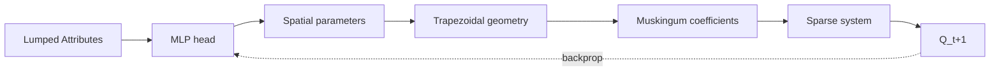
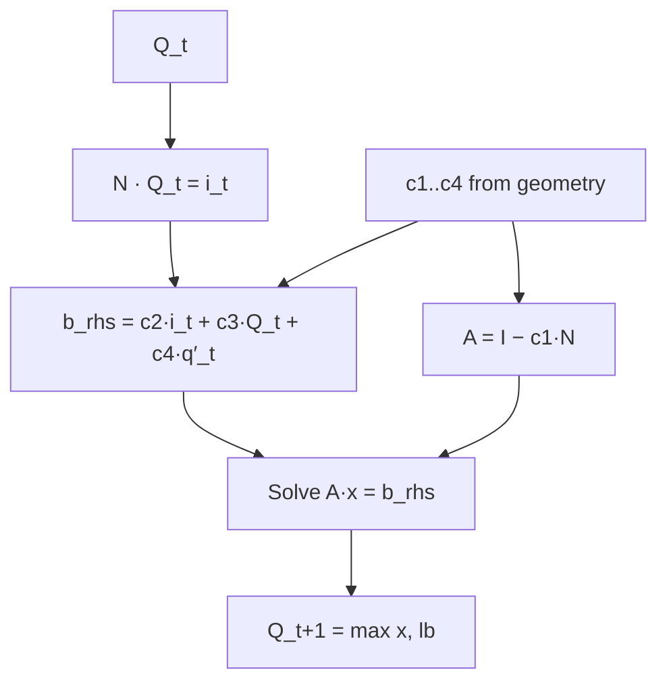

# /regenerate-docs

Invoked manually before opening a PR that touches `.claude/skills/ddrs-*.md`
or any source file those skills reference. Rewrites the affected chapters
under `docs/` so the published mdBook stays in sync with the source-of-truth
skills.

## Contract

**Inputs:**
- `.claude/skills/ddrs-*.md` — canonical skills, YAML frontmatter required.
- `.claude/skills/.regenerate-state.json` — last-regenerated commit SHA per skill.
- Git working tree at HEAD.

**Outputs:**
- `docs/<output>.md` for each skill whose frontmatter declares `output:`.
- `docs/SUMMARY.md` rewritten from the chapter-order list below.
- `.claude/skills/.regenerate-state.json` updated with the new HEAD SHA per regenerated skill.

**Not autonomous.** This skill is invoked only via `/regenerate-docs`. It does not run on save, on commit, or in CI.

## Step-by-step behavior

1. **Inventory.** Glob `.claude/skills/ddrs-*.md` (exclude `.regenerate-state.json`). For each, parse YAML frontmatter; require `name`, `description`, `output`, `sources` (list).

2. **Load state.** Read `.claude/skills/.regenerate-state.json` (default `{}` if missing). Each entry maps `name` → `last_commit_sha`.

3. **Detect changes.** For each skill, compute:
   ```
   touched_files = [skill_path, *sources]
   last_sha = state.get(name, None)
   if last_sha is None:
       needs_regen = True
   else:
       new_commits = `git log --format=%H --no-merges {last_sha}..HEAD -- {touched_files}`
       needs_regen = bool(new_commits)
   ```

4. **Expand each changed skill.** For each:
   - Read the canonical skill body.
   - Read each file in `sources`.
   - Read recent commits: `git log --oneline -20 -- {sources}`.
   - Honor inline directives in the skill body:
     - `<!-- expand-with: <path> -->` inlines the referenced file as a code block.
     - `<!-- diagram: <name> -->` inserts the named mermaid diagram from the library below.
     - `<!-- cross-ref: <other-skill-name>[, ...] -->` produces relative anchor links to the other chapters.
   - Write a polished narrative mdBook chapter to `docs/<output>`. Open with a brief intro paragraph; expand each `##` section from the skill into prose; include runnable code blocks and KaTeX math; cross-link to other chapters by their output paths.
   - Sections expected in every chapter: `# <Title>`, intro, `## What it is`, `## How to use it` (or analogous), `## Reference`, `## See also`.

5. **Rewrite SUMMARY.md** from the chapter order below. Manual edits will be overwritten.

6. **Sanity-check.**
   - For every `[link](path)` in SUMMARY.md, confirm `docs/<path>` exists.
   - Run `mdbook build`; surface KaTeX/mermaid/markdown errors.

7. **Update state.** Set `state[name] = HEAD_sha` for each skill regenerated.

8. **Report.** Print:
   - Chapters regenerated, chapters skipped (unchanged).
   - Any sanity-check warnings/errors.
   - Reminder: `git diff docs/` before staging.

## Chapter order (drives SUMMARY.md)

```
# Summary

[Introduction](intro.md)

# Getting started

- [Setup](setup.md)
- [Running the code](usage/running.md)

# Core concepts

- [Architecture](architecture.md)
- [Algorithm](algorithm.md)

# Working with ddrs

- [Reading inputs](usage/inputs-reading.md)
- [Formatting inputs](usage/inputs-formatting.md)
- [Graph objects](usage/graph-objects.md)
- [Reading outputs](usage/outputs.md)

# Reference

- [Comparing to DDR](reference/ddr-comparison.md)
- [Performance & CUDA Graphs](reference/perf.md)
- [BURN autograd recipe](reference/burn-autograd.md)
```

## Mermaid diagram library

Named diagrams the meta-skill can insert via `<!-- diagram: <name> -->`:

### `dataflow`



### `timestep`



## Sanity-check checklist

- [ ] Every canonical skill has frontmatter with `name`, `description`, `output`, `sources`.
- [ ] Every `output:` resolves to a path under `docs/`.
- [ ] SUMMARY.md links to every regenerated chapter (no dangling refs).
- [ ] `mdbook build` exits 0 with no warnings.
- [ ] `.regenerate-state.json` has been updated for every regenerated skill.

## Hallucination guard

When expanding a canonical skill, do NOT invent function signatures, file
paths, or API details. If the skill body asserts something not directly
backed by its `sources` files, flag it in the report — do not write it
into the chapter. Use the Read tool to verify before asserting.
