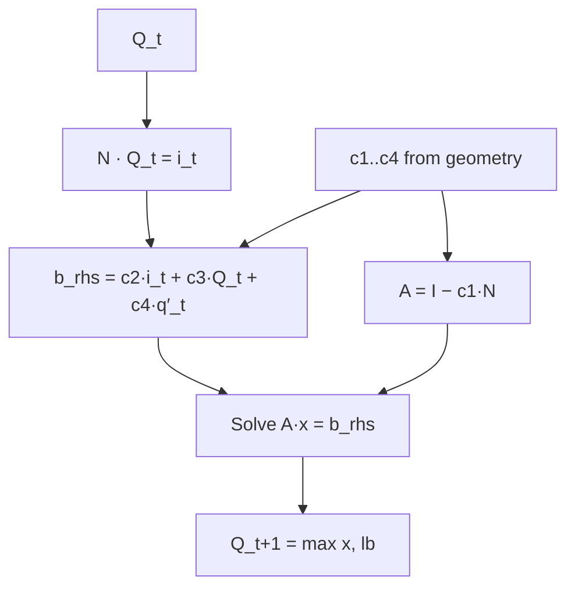

# Algorithm

This chapter describes the Muskingum-Cunge routing math ddrs runs per
reach per timestep across a CONUS-scale river network. The physics is
fixed — trapezoidal channels, Leopold-Maddock hydraulic geometry,
Manning's equation, and the standard four-coefficient Muskingum update.
What is *learned* is the spatial parameter field
`(n, q_spatial, p_spatial)`: a per-reach Manning's roughness and the two
Leopold-Maddock width/depth exponents, emitted by an MLP head from
catchment attributes. What makes the whole thing differentiable is that
every algebraic op in the per-step chain is autograd-traced through
`TimestepOp`'s analytical backward.

The result: gradients of any loss on routed discharge flow back to the
MLP weights in **one** `Backward<I, 5>` node per timestep (not ~33), and
ddrs matches DDR gradient-for-gradient at the f32 precision floor.

## What it is

The solver is a port of `~/projects/ddr/src/ddr/routing/mmc.py`
(`MuskingumCunge`). Each timestep `t` runs a fixed 28-step chain — the
source labels the steps S1..S28 — that the implementation splits across
two functions:

- `forward_chain_inner` in `src/routing/mmc_op.rs` runs S1..S28 at the
  **inner-backend** level (no autograd tape pushes), returning
  `q_next` plus the 23 saved intermediates the backward needs.
- `compute_trapezoidal_geometry` in `src/geometry.rs` mirrors S1..S15
  (the geometry block) as a standalone, autograd-friendly diagnostic
  path — same equations, same `q + 1e-6` epsilon, same `(3 / (5 + 3q))`
  depth exponent, same `[0.5, 50]` side-slope clamp.

The high-level loop, from the `mmc.rs` module doc:

```text
per timestep t:
  1. trapezoidal geometry from Q_t  →  velocity v
  2. celerity  c = clamp(v, v_lb, 15) · 5/3
  3. k = L/c;  Muskingum c1..c4  (dt = 3600 s, hardcoded)
  4. solve (I − c1·N) · Q_{t+1} = c2·(N·Q_t) + c3·Q_t + c4·q'   (CSR + analytical backward)
  5. Q_{t+1} := clamp(Q_{t+1}, discharge_lb)
```

The hardcoded timestep is `DT_SECONDS = 3600.0` (`src/routing/mmc.rs`).

### Trapezoidal geometry

For each reach at each timestep, with discharge $Q_t$, Manning's $n$,
Leopold-Maddock parameters $(p, q)$, and slope $s$, the geometry block
S1..S15 in `src/routing/mmc_op.rs` (mirrored by `src/geometry.rs`)
computes the channel cross-section.

A small `q_eps = q_spatial + 1e-6` is added to keep the depth exponent
away from a singular value further down (S1):

$$q_\varepsilon = q_{\text{spatial}} + 10^{-6}$$

Invert Manning's equation for depth. Substituting the Leopold-Maddock
top-width power law $T = p \cdot d^{q_\varepsilon}$ into the trapezoidal
flow area and Manning's equation gives a closed form for depth in terms
of discharge (S2..S6):

$$d = \max\!\left(\!\left(\frac{Q_t \cdot n \cdot (q_\varepsilon + 1)}{p \cdot \sqrt{s} + 10^{-8}}\right)^{\!\!3/(5 + 3 q_\varepsilon)}\!\!,\ d_{\text{lb}}\right)$$

The intermediate `ratio` (numerator over `denominator = p·√s + 1e-8`)
and the `exponent = 3 / (5 + 3·q_eps)` are both saved for the backward.
The `clamp_min(..., depth_lb)` floor (from
`cfg.params.attribute_minimums.depth`) protects the downstream side-slope
and bottom-width formulas when the MLP head is mid-training and the
unclamped geometry would otherwise turn non-physical.

Top width from the Leopold-Maddock power law (S7):

$$T = p \cdot d^{q_\varepsilon}$$

Side slope $z$ (H:V) — how much wider the top is than the bottom per
unit depth — clamped to a physically plausible band `[0.5, 50]` (S8..S9):

$$z = \mathrm{clamp}\!\left(\frac{T \cdot q_\varepsilon}{2 d},\ 0.5,\ 50\right)$$

Bottom width: with top width and side slope known, the trapezoid gives
the bottom width directly, clamped to
`attribute_minimums.bottom_width` so a near-degenerate section doesn't
blow up (S10..S11):

$$b = \max(T - 2 z d,\ b_{\text{lb}})$$

Cross-sectional area, wetted perimeter, hydraulic radius — pure
trapezoidal area and perimeter (S12..S14):

$$A = \frac{(T + b) \cdot d}{2}, \quad
P_w = b + 2 d \sqrt{z^2 + 1}, \quad
R = \frac{A}{P_w}$$

Manning's velocity, then clamp to $[v_{\text{lb}},\ 15]$ m/s (S15..S16).
The hard upper cap on velocity prevents non-physical celerities from
locking up the downstream Muskingum coefficient computation:

$$v = \mathrm{clamp}\!\left(\frac{1}{n} \cdot R^{2/3} \cdot \sqrt{s},\ v_{\text{lb}},\ 15\right)$$

Every clamp bound comes from `cfg.params.attribute_minimums` — see
[Formatting inputs](usage/inputs-formatting.md) for the YAML keys.

### Muskingum-Cunge coefficients

The kinematic-wave assumption sets the wave celerity at $5/3$ of the
clamped mean velocity (S17). The storage time $k$ — how long water
spends transiting the reach — is `length / celerity` (S18):

$$c = \tfrac{5}{3} v, \qquad k = \frac{L}{c}$$

With storage weight $x \in [0, 0.5]$ and timestep $\Delta t =
3600\,\text{s}$, the standard Muskingum coefficients (S18..S23, mirrored
by `calculate_muskingum_coefficients` in `src/routing/mmc.rs`) are:

$$\mathrm{denom} = 2k(1 - x) + \Delta t$$

$$c_1 = \frac{-2kx + \Delta t}{\mathrm{denom}}, \quad
c_2 = \frac{2kx + \Delta t}{\mathrm{denom}}, \quad
c_3 = \frac{2k(1 - x) - \Delta t}{\mathrm{denom}}, \quad
c_4 = \frac{2 \Delta t}{\mathrm{denom}}$$

By construction $c_1 + c_2 + c_3 = 1$ (modulo f32 round-off), which is
what makes the Muskingum step conservative for the routed component. The
fourth coefficient $c_4$ scales the lateral inflow forcing $q'_t$ — the
runoff that joins the channel between gauges.

## How to use it — the sparse system per timestep

The per-timestep routing equation, written for every reach
simultaneously with an inflow $i_t = N \cdot Q_t$ from the upstream
adjacency $N$ (CSR, topologically ordered, lower-triangular per
`CLAUDE.md` invariant 3), is:

$$Q_{t+1} = c_1 \cdot i_{t+1} + c_2 \cdot i_t + c_3 \cdot Q_t + c_4 \cdot q'_t$$

The trick is that $i_{t+1} = N \cdot Q_{t+1}$ — the next-step inflow
depends on the not-yet-known next-step discharge. Rearranging gives a
sparse linear system whose left-hand matrix is the identity minus a
scaled adjacency:

$$(I - c_1 \cdot N) \cdot Q_{t+1} = c_2 \cdot i_t + c_3 \cdot Q_t + c_4 \cdot q'_t$$

The SpMV-assemble-solve-clamp tail of `forward_chain_inner`
(`src/routing/mmc_op.rs`) implements this as S24..S28:



- **S24** — `i_t = N · q_t` via `spmv_primitive` (cuSPARSE on GPU,
  scatter-add on CPU).
- **S25** — `b_rhs = c2·i_t + c3·q_t + c4·q_prime_t`, assembled
  element-wise.
- **S26** — `a_values = assemble_primitive(c1)` builds the CSR values of
  $A = I - c_1 \cdot N$ in-place over the shared `Arc<CsrPattern>`.
- **S27** — `x_sol = triangular_csr_solve(a_values, b_rhs)` runs
  forward-substitution on CPU or cuSPARSE SpSV on GPU. Both rely on the
  lower-triangular topological ordering — by construction the diagonal of
  $A$ is $1$, every off-diagonal sits in a lower-row, lower-column
  position, and a single forward-substitution sweep computes the solution
  exactly.
- **S28** — `q_next = clamp_min(x_sol, discharge_lb)` enforces the
  non-negativity floor from `cfg.params.attribute_minimums.discharge`.

`MuskingumCunge::forward` (`src/routing/mmc.rs`) drives the loop: it
clamps `q_prime` once, seeds column 0 with the cold-start discharge, then
calls `route_timestep` for each of the remaining steps and concatenates
the columns into an `[n, T]` output (segment × time). Each
`route_timestep` delegates to `timestep_forward` (the per-step
tape-registering entry point) or, when CUDA graphs are active, to
`timestep_forward_via_graph`.

### Cold start

Before the loop, `setup_inputs` cold-starts discharge at $t = 0$ by
solving $(I - N) \cdot Q_0 = q'_0$ through the same triangular path — it
assembles `A_values` with `c = 1` (an all-ones vector) and runs the same
`triangular_csr_solve`, then clamps to `discharge_lb`. The reference math
is in `src/routing/utils.rs::compute_hotstart_discharge`; on a linear
chain this reduces to a cumulative sum.

The static channel attributes — adjacency `N`, reach length `L`, and
slope `s` — arrive bundled in a `SparseAdjacency` so they share the same
topological order; `setup_inputs` uploads them, clamps slope to
`attribute_minimums.slope`, denormalizes the `[0,1]` NN parameters into
their physical ranges, and builds the `CsrPattern` + `AValuesAssembler`
once for reuse across every timestep. See
[Graph objects](usage/graph-objects.md) for how that sparse machinery is
constructed.

## Why it is differentiable

`TimestepOp` in `src/routing/mmc_op.rs` registers a single
`Backward<I, 5>` node per timestep whose **five parents**, in fixed
order, are:

1. `n` — Manning's roughness (registered, learned).
2. `q_spatial` — Leopold-Maddock width exponent (registered, learned).
3. `p_spatial` — Leopold-Maddock width coefficient (registered, learned).
4. `q_t` — previous-step discharge (tape link to the prior `TimestepOp`).
5. `q_prime_t` — lateral inflow forcing (registered upstream from the
   streamflow forcing reader).

The three remaining inputs — `length`, `slope`, `x_storage` — are saved
constants, not parents; the chain does not differentiate through them.

`TimestepState` saves 23 forward intermediates (`NUM_SAVED_STATE = 23`):
depth, top_width, side_slope, bottom_width, hydraulic_radius, the
unclamped and clamped velocities, celerity, $k$, denom, $c_1..c_4$,
`a_values`, `b_rhs`, $i_t$, `x_sol`, plus the pre-clamp `ratio`,
`denominator`, $q_\varepsilon$, `side_slope_raw`, and `bw_raw`. Their
positions are pinned by `forward_saved_idx` so the forward and backward
agree on the layout.

The backward consumes `∂L/∂q_next`, walks S28→S1 in reverse with
closed-form partials at each algebraic step (`mmc_op.rs` labels them
B28..B1), and pushes accumulated gradients onto the five parent tapes.
Two of those reverse steps call into the sparse op's own adjoints rather
than re-deriving them inline:

- **B27** — the triangular-solve adjoint $\text{grad}_{b} =
  (A^T)^{-1} \cdot \text{grad}_{x}$, then
  $\text{grad}_{A}[k] = -\text{grad}_{b}[\text{row}_k] \cdot
  x_\text{sol}[\text{col}_k]$.
- **B24** — the SpMV adjoint $\text{grad}_{q_t} = N^T \cdot
  \text{grad}_{i_t}$.

Because each parent appears at several points in the chain, the backward
accumulates partial contributions before registering. For example
$q_t$'s gradient sums three terms — `gq_t_from_s25` (the $c_3 \cdot Q_t$
term), `gq_t_from_s24` (the SpMV adjoint), and `gq_t_from_s2` (the depth
formula's $Q_t$ dependence).

See the [BURN autograd recipe](reference/burn-autograd.md) for the
`Backward`/`Ops`/`OpsKind` plumbing both `TimestepOp` and `CsrSolveOp`
follow.

The net effect: tape size is **O(parents + saved_state)** per step
instead of the **O(n²)** blowup an autograd-tape unrolling of the whole
sparse solve would produce. On a CONUS-scale network with $n = 346{,}321$
reaches over tens of timesteps, that is the difference between trainable
and "out of GPU memory at batch 1." See
[Performance](reference/perf.md) for the SP-8/SP-9/SP-10 work that fused
the chain and added cuSPARSE + CUDA-graph paths.

## Reference

### Constants and bounds

| Symbol | Source | Meaning |
|---|---|---|
| $\Delta t$ | `DT_SECONDS = 3600.0` (`mmc.rs`) | Routing timestep, seconds |
| $5/3$ | S17 (`mmc_op.rs`) | Kinematic-wave celerity ratio |
| `[0.5, 50]` | S9 (`mmc_op.rs`, `geometry.rs`) | Side-slope clamp band |
| `[v_lb, 15]` | S16 (`mmc_op.rs`) | Velocity clamp, m/s |
| $10^{-6}$ | S1 (`q_eps`) | Depth-exponent epsilon |
| $10^{-8}$ | S3 (`denominator`) | Manning-inversion denominator epsilon |
| `depth_lb`, `bottom_width_lb`, `velocity_lb`, `discharge_lb`, `slope` | `cfg.params.attribute_minimums` | Physical floors |

### Key functions

| Function | File | Role |
|---|---|---|
| `MuskingumCunge::setup_inputs` | `src/routing/mmc.rs` | Bind inputs, build CSR pattern, denormalize, cold-start |
| `MuskingumCunge::calculate_muskingum_coefficients` | `src/routing/mmc.rs` | $c_1..c_4$ |
| `MuskingumCunge::route_timestep` / `forward` | `src/routing/mmc.rs` | One step / full `[n, T]` window |
| `forward_chain_inner` | `src/routing/mmc_op.rs` | S1..S28 on the inner backend |
| `timestep_forward` | `src/routing/mmc_op.rs` | Run S1..S28, register the `TimestepOp` node |
| `TimestepOp::backward` | `src/routing/mmc_op.rs` | Analytical B28..B1 reverse pass |
| `compute_trapezoidal_geometry` | `src/geometry.rs` | Standalone S1..S15 diagnostic path |

### Gotchas

1. **f32 precision floor.** The DDR comparison sits at ~1e-7 relative
   diff per reach. Any cast to f64/bf16 inside the timestep chain breaks
   bit-for-bit reproducibility against the reference and forfeits the
   ABSOLUTE MATCH invariant from `CLAUDE.md`.
2. **Clamps are load-bearing — and all come from
   `cfg.params.attribute_minimums`** (`src/routing/mmc_op.rs`):
   `depth_lb`, `bottom_width_lb`, `velocity_lb`, `discharge_lb`, plus the
   hard-coded `[0.5, 50]` band on side slope and `[v_lb, 15]` cap on
   velocity. Changing any of these without re-validating against DDR
   breaks the V1 invariant; they exist precisely because the unclamped
   geometry can go non-physical when the MLP head is mid-training.
3. **Gradient-exact match against DDR is the bar.** Forward parity alone
   isn't sufficient — `sp8_gradcheck` exists because a subtly wrong
   analytical backward will silently miscompute parameter updates. If you
   touch S1..S28 or any saved-state index, re-run both the forward and
   gradient checks before claiming the change works.
4. **`q_eps = q_spatial + 1e-6` and `denominator + 1e-8` are not
   cosmetic.** They keep the depth formula well-defined when `q_spatial`
   or the slope term hits zero. Removing them produces NaNs that
   propagate through the entire backward.

### Verification

The two gates for any change to the routing-core math:

```bash
# Finite-difference check on the TimestepOp analytical backward.
cargo test --test sp8_gradcheck -- --ignored

# V1 ABSOLUTE MATCH against the 5-reach RAPID sandbox.
cargo run --release --example compare_ddr_sandbox
```

`sp8_gradcheck` is the gradient gate: each of the five parents'
analytical gradients must agree with central differences over the chain.
`compare_ddr_sandbox` is the forward gate: max abs diff < `1e-3 m³/s`
over the entire sandbox run.

If `sp8_gradcheck` fails but V1 passes, the analytical backward is wrong
and silently miscomputing parameter updates — a worse failure than a
forward mismatch, because nothing in the training loop will catch it. If
both fail, the change to the chain is more fundamental.

## See also

- [Architecture](architecture.md) — module map and the per-timestep
  dataflow this chapter implements.
- [Graph objects](usage/graph-objects.md) — `CsrPattern`,
  `AValuesAssembler`, and how `setup_inputs` builds the sparse system the
  algorithm runs against.
- [BURN autograd recipe](reference/burn-autograd.md) — the
  `Backward<I, N>` plumbing the single-node-per-timestep design depends
  on.
- [Performance](reference/perf.md) — the fused-kernel, cuSPARSE, and
  CUDA-graph work behind the S24..S28 sparse path.
- [Comparing to DDR](reference/ddr-comparison.md) — the V1 regression
  details and what to inspect when it drifts.
