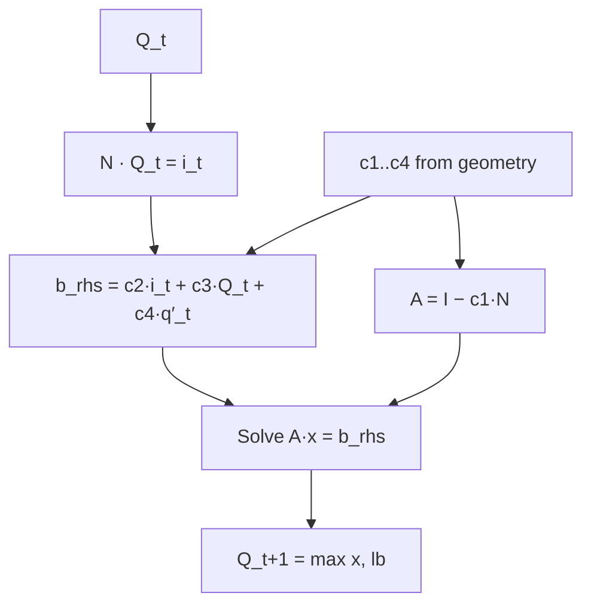

# Architecture

This chapter explains how the ddrs crate is laid out and how a single
timestep flows through the routing core. The headline is that `ddrs`
is a BURN-based Rust port of DDR's differentiable Muskingum-Cunge
routing solver: spatial NN-derived parameters flow in, a 2-D `(time,
reach)` discharge tensor flows out, and gradients trace cleanly back
to the upstream MLP head. Reading this chapter before touching
`src/routing/` or `src/sparse/` will save you from a lot of debugging.

## The autograd boundary

`MuskingumCunge::forward(q_prime) -> Tensor<Autodiff<I>, 2>` is the
public boundary between the differentiable solver and the rest of the
training stack. Inside that call:

- The **inputs** are spatial parameters `(n, q_spatial, p_spatial)`
  emitted by the MLP head from catchment attributes, plus the
  per-timestep lateral inflow `q_prime`.
- The **outputs** are a 2-D `(time, reach)` discharge tensor on the
  autodiff backend `Autodiff<I>`.
- The **inner-backend generic** `I` resolves at compile time to
  `NdArray<f32>` (CPU) or `Cuda<f32, i32>` (GPU). The autograd machinery
  wraps that inner backend with `Autodiff<I>` so all standard BURN ops
  trace their adjoints automatically. Where ddrs needs the chain to be
  shorter than the naive BURN ops would produce — every step of the
  Muskingum chain and every sparse triangular solve — a hand-written
  `Backward<I, N>` collapses many ops into one tape node.

What is **fixed** for a given network:

- Channel adjacency `N` (topologically ordered, lower-triangular CSR
  per the CLAUDE.md invariant).
- Per-reach length, slope.
- Timestep `dt = 3600 s`.

What is **learned**:

- `n` — Manning's roughness.
- `q_spatial` — Leopold-Maddock width exponent.
- `p_spatial` — Leopold-Maddock width coefficient (optionally; the
  default merit YAML defaults this to a scalar `21.0` rather than
  learning it).

All learned parameters are emitted by the MLP head as `[0, 1]` values
and denormalized via the configured `parameter_ranges` and
`log_space_parameters` from `config.rs`. The Muskingum storage weight
`x_storage` is supplied per-batch and typically held constant in
practice.

## Module map

| Path | Responsibility | Mirrors (in DDR) |
|---|---|---|
| `src/routing/mmc.rs` | `MuskingumCunge<I>` engine: `setup_inputs`, `forward`, `route_timestep`. Holds NN params + cached attributes. | `ddr/routing/mmc.py` |
| `src/routing/mmc_op.rs` | `TimestepOp` — single custom `Backward<I, 5>` per timestep. `forward_chain_inner` runs S1..S28 at the backend-primitive level. `TimestepState` saves 23 intermediates. | (no direct analog — SP-8 fusion is ddrs-specific) |
| `src/routing/utils.rs` | `denormalize`, `compute_hotstart_discharge`, dense helpers. | `ddr/routing/utils.py` |
| `src/sparse/mod.rs` | `CsrPattern` (Arc-shared per network), `SparseAdjacency`, `spmv_primitive`, `assemble_primitive`, `triangular_csr_solve`, hand-written `CsrSolveOp impl Backward`. | (DDR uses SciPy/CuPy `spsolve_triangular` with a custom `torch.autograd.Function`) |
| `src/sparse/cusparse.rs` | cuSPARSE `SpMV` + `SpSV` FFI wrappers, descriptor cache on `CudaPatternCache`. | (DDR uses CuPy directly) |
| `src/sparse/dispatch.rs` | Routes between CPU forward-sub and cuSPARSE SpSV per `cfg.params.sparse_solver`. | — |
| `src/cuda_graph/` | SP-10 CUDA Graph capture/replay. `capture.rs`, fused `#[cube]` kernels in `geometry_kernel.rs`, persistent handle scratch in `scratch.rs`. | (ddrs-specific perf layer) |
| `src/geometry.rs` | Trapezoidal channel geometry (Leopold & Maddock), pure math used by `forward_chain_inner`. | `ddr/geometry/trapezoidal.py` |
| `src/config.rs` | YAML config, parameter ranges, attribute minimums, log-space flags, `SparseSolver` enum. | `ddr/validation/configs.py` (Params subset) |
| `src/nn/mlp.rs` | MLP head producing `[0, 1]` parameters, replaces DDR's KAN with the same I/O contract. | `ddr/nn/kan.py` (interface only) |
| `src/data/` | Live readers for DDR's training data — zarr/netcdf/icechunk. `ids.rs` (`Comid`/`Staid`), `dates.rs` (rho-window sampler), `store/zarr.rs` (`ConusAdjacencyStore`, `GagesAdjacencyStore`). | `ddr/data/` (`Dates`, gauge selection, etc.) |
| `src/training/` | Training driver: `forward.rs`, `loss.rs`, `metrics.rs`, `optimizer.rs`, `checkpoint.rs`, zarr output. | `ddr/training/` |
| `src/bin/` | CLI entry points (`merit_train`, etc.). | `ddr/scripts/` |

The crate splits along four orthogonal axes: routing (`routing/`,
`sparse/`, `geometry.rs`), data (`data/`), neural network (`nn/`), and
training driver (`training/`, `bin/`). The CUDA-Graphs perf layer
under `src/cuda_graph/` is a sibling of `routing/` rather than living
inside it, because it monkey-patches the per-timestep dispatch from the
outside via `setup_inputs`.

## Per-timestep dataflow

`MuskingumCunge::route_timestep` is a thin wrapper around `TimestepOp`.
The forward chain (`forward_chain_inner` in `src/routing/mmc_op.rs`)
runs at the inner-backend primitive level — no autograd nodes inside
— and emits the next discharge `q_next` plus 23 saved intermediates
that the analytical backward needs.



The chain in code, step by step (the S-numbers reference annotations
on `forward_chain_inner`):

```
inputs: (n, q_spatial, p_spatial, q_t, q_prime_t, length, slope, x_storage)

──────────────────────── K1: geometry + Muskingum coefficients ────────────
  S1   q_eps        = q_spatial + 1e-6
  S2   numerator    = q_t · n · (q_eps + 1)
  S3   denominator  = p_spatial · √slope + 1e-8
  S4   ratio        = numerator / denominator
  S5   exponent     = 3 / (3·q_eps + 5)
  S6   depth        = clamp_min(ratio^exponent, depth_lb)
  S7   top_width    = p_spatial · depth^q_eps
  S8   ss_raw       = top_width · q_eps / (2·depth)
  S9   side_slope   = clamp(ss_raw, 0.5, 50)
  S10  bw_raw       = top_width − 2·side_slope·depth
  S11  bottom_width = clamp_min(bw_raw, bottom_width_lb)
  S12  area         = (top_width + bottom_width)·depth / 2
  S13  wp           = bottom_width + 2·depth·√(side_slope² + 1)
  S14  hyd_radius   = area / wp
  S15  v_un         = (1/n)·hyd_radius^(2/3)·√slope
  S16  v_cl         = clamp(v_un, velocity_lb, 15)
  S17  celerity     = v_cl · 5/3
  S18  k_muskingum  = length / celerity
  S19  one_minus_x  = 1 − x_storage
  S20  two_k        = 2·k_muskingum
  S21  two_kx       = two_k·x_storage
  S22  two_k_1mx    = two_k·one_minus_x
  S23  denom, c1, c2, c3, c4   (Muskingum coefficients, denom = two_k_1mx + dt)

──────────────────────────── SpMV ─────────────────────────────────────────
  S24  i_t = N · q_t          (spmv_primitive — cuSPARSE on GPU, scatter on CPU)

──────────────────────── K2: RHS assembly ─────────────────────────────────
  S25  b_rhs = c2·i_t + c3·q_t + c4·q_prime_t

──────────────────────── A-values assembly ────────────────────────────────
  S26  a_values = assemble_primitive(c1)        (CSR A = I − c1·N)

──────────────────────── SpSV ─────────────────────────────────────────────
  S27  x_sol = triangular_csr_solve(a_values, b_rhs)
              (forward-sub on CPU; cuSPARSE SpSV on GPU)

──────────────────────── K3: clamp ────────────────────────────────────────
  S28  q_next = clamp_min(x_sol, discharge_lb)
```

On the CUDA path, S1..S23 collapse into one fused `#[cube]` kernel (K1),
S25 into K2, and S28 into K3 — so the captured per-timestep sequence
is exactly:

```
K1  →  cuSPARSE SpMV  →  K2  →  assemble  →  cuSPARSE SpSV  →  K3
```

Six kernel launches per timestep, replayed as a single `cuGraphLaunch`.
See [Performance & CUDA Graphs](reference/perf.md) for how the capture
itself is wired and which fused kernels back each of K1, K2, K3.

Cold start at `t = 0` solves `(I − N) · Q_0 = q'_0` through the same
triangular path. On a linear chain this reduces to a simple cumulative
sum: `Q_0[i] = Σ_{j ≤ i} q'_0[j]`. See
`src/routing/utils.rs::compute_hotstart_discharge`.

## Autograd model

`TimestepOp` registers **one** `Backward<I, 5>` node per timestep
instead of the ~33 individual op nodes the naive BURN-tensor-op chain
would push. Parents are fixed in this order:

1. `n` — Manning's roughness.
2. `q_spatial` — Leopold-Maddock width exponent.
3. `p_spatial` — Leopold-Maddock width coefficient.
4. `q_t` — previous-step discharge (tape link to the prior `TimestepOp`).
5. `q_prime_t` — lateral inflow forcing.

`TimestepState` saves the 23 forward intermediates the analytical
chain rule needs: depth, top_width, side_slope, bottom_width,
hyd_radius, two velocities (unclamped + clamped), celerity,
`k_muskingum`, denom, `c1..c4`, `a_values`, `b_rhs`, `i_t`, `x_sol`,
plus five S1..S10 pre-clamp intermediates (ratio, denominator,
`q_eps`, `side_slope_raw`, `bw_raw`).

The backward then consumes `∂L/∂q_next`, walks the chain in reverse
using only inner-backend primitive ops, and registers gradients on
the five parent tapes. Each step has a closed-form local Jacobian; the
chain rule composes them in reverse without ever touching the BURN
autograd-tape machinery beyond the one `Backward` node.

The sparse solve has its own `CsrSolveOp impl Backward`
(`src/sparse/mod.rs`) which keeps the tape size **O(nnz)** per step
rather than **O(n²)**. The full recipe both ops follow — visibility
of `Backward`/`Ops`/`OpsKind` from a downstream crate, how to pass
unnameable `NodeRef` values, what `State` to save — is in
[BURN autograd recipe](reference/burn-autograd.md).

## Gotchas

1. **V1 invariant — non-negotiable.** `cargo run --release --example
   compare_ddr_sandbox` must report `ABSOLUTE MATCH` (max abs <
   `1e-3 m³/s` on the 5-reach RAPID sandbox). Re-run after every
   change to `src/routing/`, `src/sparse/`, `src/geometry.rs`, or
   `src/cuda_graph/`. See [Comparing to DDR](reference/ddr-comparison.md).
2. **f32 throughout the routing core.** DDR parity sits at the f32
   precision floor (~1e-7 rel diff per reach). Any cast to f64/bf16
   inside the timestep chain breaks reproducibility against the
   reference.
3. **Adjacency is topologically ordered and lower-triangular**
   (`rows[k] >= cols[k]`). The forward-sub solver and cuSPARSE SpSV
   both assume it. Tested via
   `data_zarr_store::conus_adjacency_loads_real_merit_zarr`.
4. **Don't replace the hand-written sparse backward with autograd-tape
   unrolling.** `CsrSolveOp impl Backward` in `src/sparse/mod.rs` is
   what keeps the tape O(nnz) per timestep instead of O(n²). Same
   applies to `TimestepOp` — collapse, don't expand. The point of
   both custom backwards is short tapes.
5. **One `Arc<CsrPattern>` per network**, built once at `setup_inputs`
   and reused for every timestep. Don't rebuild per step; don't clone
   the underlying buffers. See [Graph objects](usage/graph-objects.md).
6. **CUDA Graphs require the cubecl fork's `flush_no_sync` patch.**
   Naive capture deadlocks on cubecl's stock host-sync inside `flush`.
   See the SP-10 journal in `.claude/ARCHITECTURE.md`.

## Verification

The architecture's correctness is verified at three levels:

| Check | Command | Locks |
|---|---|---|
| V1 ABSOLUTE MATCH | `cargo run --release --example compare_ddr_sandbox` | End-to-end forward parity with DDR on the 5-reach sandbox |
| MMC unit tests | `cargo test --test mmc` | Hotstart, coefficients, forward, autodiff on the 5-reach linear chain |
| Sparse gradcheck | `cargo test --test sparse_gradcheck` | Finite-difference check on `CsrSolveOp`'s analytical backward |
| V9 (graph bit-match) | `DDRS_FORCE_GRAPHS=1 cargo run --release --example compare_ddr_sandbox` | The CUDA-graph capture path produces ABSOLUTE MATCH against the CPU path |

V1 is the cross-language gate (does ddrs match DDR?); the unit tests
cover the in-crate invariants; V9 covers the graph-capture path
specifically. The architecture is correct iff all four pass.

## See also

- [Algorithm](algorithm.md) — the math behind the S1..S28 chain and
  why every step is differentiable.
- [Graph objects](usage/graph-objects.md) — `CsrPattern`,
  `AValuesAssembler`, and `setup_inputs` as the binding boundary.
- [Performance & CUDA Graphs](reference/perf.md) — how the K1/K2/K3
  fused kernels back the captured per-timestep sequence.
- [BURN autograd recipe](reference/burn-autograd.md) — the
  `Backward<I, N>` pattern both `TimestepOp` and `CsrSolveOp` follow.
- [Comparing to DDR](reference/ddr-comparison.md) — V1 details and
  what failure modes mean.
