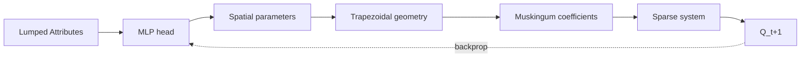

# ddrs

`ddrs` is a BURN-based Rust port of the differentiable Muskingum-Cunge
routing solver from [DDR](https://github.com/mhpi/ddr) (Python/PyTorch).
The port is **gradient-exact** against DDR at the f32 precision floor and
landed forward CUDA Graphs in SP-10 with a measured V7a wall-time ratio
of **0.385** — CUDA finishes a 3-batch smoke train in 1.96 minutes versus
CPU's 5.09 minutes, a 2.6× speed-up.

The published mdBook is regenerated from the canonical agent-readable
reference docs under `.claude/references/ddrs-*.md` via the `/regenerate-docs`
meta-skill. Each chapter expands its source reference into prose while
preserving the technical content verbatim. If you find a discrepancy
between a chapter and the source code it documents, the source code is
the truth — file an issue or run `/regenerate-docs` to refresh.

## Dataflow

The per-batch dataflow runs from raw catchment attributes, through an
MLP head that emits per-reach Manning's roughness and Leopold-Maddock
exponents, through the trapezoidal channel geometry that turns those
parameters into Muskingum coefficients, through one sparse triangular
solve per timestep, and back via a single custom-Backward node per
timestep so gradients trace cleanly to the MLP weights.

The autograd boundary is `MuskingumCunge::forward(q_prime) ->
Tensor<Autodiff<I>, 2>` — see [Architecture](architecture.md) for the
module map and [Algorithm](algorithm.md) for the per-step math.

## Where to start

| If you want to... | Read |
|---|---|
| Build ddrs on a fresh machine | [Setup](setup.md) |
| Train, evaluate, or run the V1 regression | [Running the code](usage/running.md) |
| Understand the module layout and per-timestep dataflow | [Architecture](architecture.md) |
| See the Muskingum-Cunge math and why it is differentiable | [Algorithm](algorithm.md) |
| Wire in DDR's live training data (zarr, netcdf, icechunk) | [Reading inputs](usage/inputs-reading.md) |
| Edit the YAML config — solver toggles, parameter ranges | [Formatting inputs](usage/inputs-formatting.md) |
| Understand `CsrPattern`, `AValuesAssembler`, `setup_inputs` | [Graph objects](usage/graph-objects.md) |
| Read the artefacts a ddrs run produces | [Reading outputs](usage/outputs.md) |
| Verify a routing-core change against DDR | [Comparing to DDR](reference/ddr-comparison.md) |
| Tune the GPU performance path | [Performance & CUDA Graphs](reference/perf.md) |
| Write a custom Backward op against BURN 0.21 | [BURN autograd recipe](reference/burn-autograd.md) |

## Status — SP-10 close

The forward CUDA-graph capture path landed in commit `e35af29`
("SP-10 close — forward CUDA Graphs at V7a=0.385"). Defaults in
`config/merit_training.yaml` are now `sparse_solver: cuda` +
`use_cuda_graphs: true`. The V1 invariant
(`cargo run --release --example compare_ddr_sandbox` reports `ABSOLUTE
MATCH` with `max abs < 1e-3 m³/s`) holds on both the CPU `NdArray`
backend and the `DDRS_FORCE_GRAPHS=1` CUDA-capture path. The backward
path still runs SP-9 direct-launch — backward CUDA graph capture is
candidate work for SP-11.

## Critical invariants

These are the four invariants the port exists to preserve. Any change
that breaks them is by definition broken:

1. **V1 ABSOLUTE MATCH** against the 5-reach RAPID sandbox
   (`< 1e-3 m³/s` max abs diff). See
   [Comparing to DDR](reference/ddr-comparison.md).
2. **f32 throughout the routing core** — no mixed precision; DDR parity
   sits at the f32 floor (~1e-7 rel diff per reach).
3. **Adjacency is topologically ordered and lower-triangular** —
   `rows[k] >= cols[k]`; the forward-sub and cuSPARSE SpSV solvers both
   assume it.
4. **Sparse backward stays hand-written.** `CsrSolveOp impl Backward`
   in `src/sparse/mod.rs` keeps the tape O(nnz) per timestep instead of
   O(n²); see [BURN autograd recipe](reference/burn-autograd.md).
