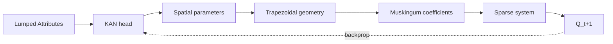

# ddrs

`ddrs` is a BURN-based Rust port of the differentiable Muskingum-Cunge
routing solver from [DDR](https://github.com/mhpi/ddr) (Python/PyTorch).
The port is **gradient-exact** against DDR at the f32 precision floor and
landed forward CUDA Graphs in SP-10 with a measured V7a wall-time ratio
of **0.385** — CUDA finishes a 3-batch smoke train in 1.96 minutes versus
CPU's 5.09 minutes, a 2.6× speed-up.

**The chapters of this book are the canonical documentation.** The
condensed agent-readable notes under `.claude/references/ddrs-*.md` are
an older back-port of the same material (last updated 2026-06-10) kept
for in-repo agent lookups; where the two disagree, the chapter here
wins. If you find a discrepancy between a chapter and the source code
it documents, the source code is the truth — file an issue.

If you arrive from a `.claude/references/` note, its counterpart chapter is:

| `.claude/references/` | Chapter |
|---|---|
| `ddrs-algorithm.md` | [Algorithm](algorithm.md) |
| `ddrs-architecture.md` | [Architecture](architecture.md) |
| `ddrs-baseline.md` | [The summed Q' baseline](reference/baseline.md) |
| `ddrs-burn-autograd.md` | [BURN autograd recipe](reference/burn-autograd.md) |
| `ddrs-comparing-to-ddr.md` | [Comparing to DDR](reference/ddr-comparison.md) |
| `ddrs-formatting-inputs.md` | [Formatting inputs](usage/inputs-formatting.md) |
| `ddrs-graph-objects.md` | [Graph objects](usage/graph-objects.md) |
| `ddrs-perf-and-cuda-graphs.md` | [Performance & CUDA Graphs](reference/perf.md) |
| `ddrs-reading-inputs.md` | [Reading inputs](usage/inputs-reading.md) |
| `ddrs-reading-outputs.md` | [Reading outputs](usage/outputs.md) |
| `ddrs-running-the-code.md` | [Running the code](usage/running.md) |
| `ddrs-setup.md` | [Setup](setup.md) |

## Dataflow

The per-batch dataflow runs from raw catchment attributes, through a
KAN head (`rskan::KanLayer` via `src/nn/kan_head.rs`) that emits
per-reach Manning's roughness and Leopold-Maddock exponents, through
the trapezoidal channel geometry that turns those parameters into
Muskingum coefficients, through one sparse triangular solve per
timestep, and back via a single custom-Backward node per timestep so
gradients trace cleanly to the KAN head's weights.

```mermaid
flowchart LR
    A[Lumped Attributes] --> B[KAN head]
    B --> C[Spatial parameters]
    C --> D[Trapezoidal geometry]
    D --> E[Muskingum coefficients]
    E --> F[Sparse system]
    F --> G[Q_t+1]
    G -.->|backprop| B
```

The autograd boundary is `MuskingumCunge::forward(q_prime) ->
Tensor<Autodiff<I>, 2>` — see [Architecture](architecture.md) for the
module map and [Algorithm](algorithm.md) for the per-step math.

## Where to start

| If you want to... | Read |
|---|---|
| Build ddrs on a fresh machine | [Setup](setup.md) |
| Train, evaluate, or run the V1 regression | [Running the code](usage/running.md) |
| Understand the module layout and per-timestep dataflow | [Architecture](architecture.md) |
| See the Muskingum-Cunge math and why it is differentiable | [Algorithm](algorithm.md) |
| Wire in DDR's live training data (zarr, netcdf, icechunk) | [Reading inputs](usage/inputs-reading.md) |
| Edit the YAML config — solver toggles, parameter ranges | [Formatting inputs](usage/inputs-formatting.md) |
| Understand `CsrPattern`, `AValuesAssembler`, `setup_inputs` | [Graph objects](usage/graph-objects.md) |
| Read the artefacts a ddrs run produces | [Reading outputs](usage/outputs.md) |
| Verify a routing-core change against DDR | [Comparing to DDR](reference/ddr-comparison.md) |
| Tune the GPU performance path | [Performance & CUDA Graphs](reference/perf.md) |
| Write a custom Backward op against BURN 0.21 | [BURN autograd recipe](reference/burn-autograd.md) |

## Status — SP-10 close (historical snapshot, 2026-05-29)

> This section records the state of the port at the SP-10 milestone
> (2026-05-29). It is kept for context and is **not** a statement of
> current project status. The maintained SP-8 / SP-9 / SP-10 write-ups
> live in `.claude/ARCHITECTURE.md`; the performance picture is in
> [Performance & CUDA Graphs](reference/perf.md).

The forward CUDA-graph capture path landed in commit `e35af29`
("SP-10 close — forward CUDA Graphs at V7a=0.385"). Defaults in
`config/merit_training.yaml` are now `sparse_solver: cuda` +
`use_cuda_graphs: true`. The V1 invariant
(`cargo run --release --example compare_ddr_sandbox` reports `ABSOLUTE
MATCH` with `max abs < 1e-3 m³/s`) holds on both the CPU `NdArray`
backend and the `DDRS_FORCE_GRAPHS=1` CUDA-capture path. The backward
path still runs SP-9 direct-launch — backward CUDA graph capture is
candidate work for SP-11.

## Critical invariants

These are the seven invariants the port exists to preserve — `CLAUDE.md`
is the authoritative list, reproduced here. Any change that breaks them
is by definition broken:

1. **V1 ABSOLUTE MATCH** against the 5-reach RAPID sandbox
   (`< 1e-3 m³/s` max abs diff). See
   [Comparing to DDR](reference/ddr-comparison.md).
2. **f32 throughout the routing core** — no mixed precision; DDR parity
   sits at the f32 floor (~1e-7 rel diff per reach).
3. **Adjacency is topologically ordered and lower-triangular** —
   `rows[k] >= cols[k]`; the forward-sub and cuSPARSE SpSV solvers both
   assume it.
4. **Sparse backward stays hand-written.** `CsrSolveOp impl Backward`
   in `src/sparse/mod.rs` keeps the tape O(nnz) per timestep instead of
   O(n²); see [BURN autograd recipe](reference/burn-autograd.md).
5. **The routing head is `rskan::KanLayer` via `src/nn/kan_head.rs`** —
   do not reintroduce the plain feed-forward placeholder head it
   replaced. The stack matches
   DDR's `kan.py` exactly: `Linear(F, H) → KanLayer(H, H) ×
   num_hidden_layers → Linear(H, P) → Sigmoid`, with no inter-block
   ReLU, and every inner `KanLayer` receiving the same seed (a DDR
   `kan.py` quirk preserved for parity).
6. **`rskan` is a git dependency pinned to a tag.** Updating it means
   bumping the tag in `Cargo.toml`, then re-running `tests/kan_head.rs`
   and the full parity sweep before merging — see [Setup](setup.md).
7. **KAN-head parity vs DDR must pass on every PR** that touches
   `src/nn/`, the `rskan` pin in `Cargo.toml`, or DDR's `nn/kan.py`.
   The sweep is `cargo test --features fixtures --test
   kan_head_init_repro --test kan_head_init_parity --test
   kan_head_fixture_forward --test kan_head_fixture_backward`.
